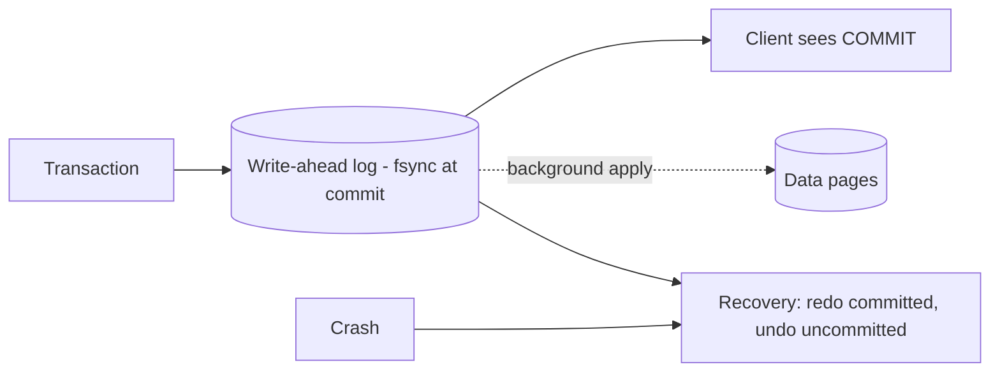

A **transaction** groups operations into an all-or-nothing unit. The textbook transfer: debit account A, credit account B — a crash between the two must not lose or invent money.

## The four guarantees

- **Atomicity** — all or nothing. Delivered by the **write-ahead log (WAL)**: changes are logged before being applied; on crash, committed transactions are redone and uncommitted ones undone. `ROLLBACK` is the same machinery on demand.
- **Consistency** — every transaction moves the DB from one valid state to another: constraints (unique, foreign key, checks) hold at commit. Note: this is *not* the C in CAP (which is about replicas agreeing).
- **Isolation** — concurrent transactions behave *as if* serialized. The expensive one — real databases sell it in levels (see isolation levels) because full serializability costs throughput.
- **Durability** — once committed, survives power loss: the WAL is fsync'd to stable storage at commit, before the client hears "OK." Data pages can be written lazily afterwards; the log is the source of truth.

## Where it bends in practice

- Replication can make durability squishy: a commit acknowledged by the primary but not yet replicated dies with the primary. Hence sync-replication options (`synchronous_commit`, quorum acks) trading latency for safety.
- Distributed transactions across services don't get ACID — two-phase commit is fragile and slow, so systems use **sagas** (local transactions + compensations) and idempotency instead.
- ORMs quietly running each statement in auto-commit mode are how "transactions" silently don't happen — always check where the transaction boundary actually is.

## Interview Q&A

**Q: How does the database guarantee atomicity mechanically?**
A: WAL + recovery. Every change is journaled with its transaction ID before touching data pages. Crash recovery replays the log: redo what committed, undo what didn't. Without the log you couldn't distinguish half-applied from applied.

**Q: Why is fsync at commit the durability linchpin?**
A: OS page caches lie — a `write()` sits in RAM. `fsync` forces the log record to stable media before acking the client. Disabling it (or fake-fsync hardware) is how "durable" databases lose acknowledged commits.

**Q: ACID consistency vs CAP consistency?**
A: ACID-C: integrity constraints within one database hold across transactions. CAP-C: all replicas of a distributed store return the latest write (linearizability). Same word, unrelated concepts — flagging that distinction is an instant credibility win.

**Q: A transfer touches two different services' databases. Options?**
A: 2PC gives atomicity but blocks on coordinator failure and couples availability — rarely used across services. Practical answer: saga — debit locally, emit an event, credit on the other side, compensate (refund) on failure — with idempotent handlers because retries will happen.

**Q: When is it OK to relax durability?**
A: When re-derivable or low-stakes: caches, metrics, session data. Databases expose the dial (async replication, `synchronous_commit=off`) — the interview answer is naming *which data* gets which setting, not one global choice.
