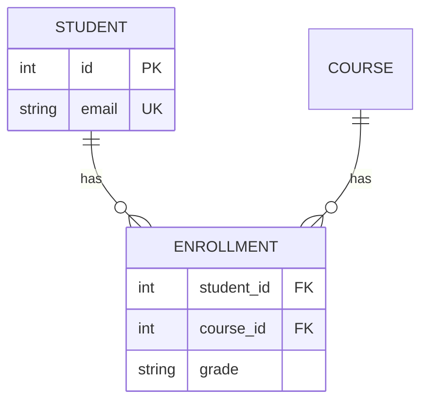

Schema design questions ("model a library / Uber / hospital") test whether you can translate a domain into tables without painting yourself into a corner. The vocabulary is ER modeling; the recurring decision is keys.

## Entities, attributes, relationships

- **Entity** → table: a thing with identity (`User`, `Course`, `Order`).
- **Attribute** → column. Composite attributes get split (address → street/city/zip); multi-valued attributes (phone numbers) become a child table — never a comma-separated column (that's a 1NF violation you'll pay for at query time).
- **Relationship** → foreign keys or junction tables, depending on cardinality:

| Cardinality | Implementation |
| --- | --- |
| 1:1 | FK with a UNIQUE constraint (or merge the tables — ask *why* they're separate: optional data, security split?) |
| 1:N | FK on the N side (`orders.user_id`) |
| M:N | **Junction table** (`enrollments(student_id, course_id, grade)`) — relationship attributes live here |

**Weak entities** depend on a parent for identity (`order_items` means nothing without an order) — composite PK `(order_id, line_no)` and `ON DELETE CASCADE` are natural here. **ISA/inheritance** (a `Vehicle` that's a Car or Truck) maps three ways: single table with nullable columns + type flag (simple, sparse), table-per-subtype joined to a base table (clean, join-heavy), or table-per-concrete-type (no joins, duplicated common columns). Name the trade, pick one.

## The key taxonomy

- **Super key** — any column set that uniquely identifies a row.
- **Candidate key** — a *minimal* super key (no removable column). A table can have several.
- **Primary key** — the candidate key you crown: unique, non-null, one per table, target of FKs.
- **Alternate key** — the candidate keys you didn't crown; enforce with UNIQUE.
- **Foreign key** — a reference to another table's key, with referential actions: `RESTRICT` (default, safe), `CASCADE` (deletes propagate — powerful and dangerous; great for weak entities, terrifying on `users`), `SET NULL` (orphan gracefully).
- **Composite key** — multi-column key (junction tables).

## Natural vs surrogate keys — the actual interview question

A **natural key** is a real-world identifier (email, ISBN, SSN); a **surrogate** is a meaningless generated ID (auto-increment, UUID).

The trap with natural keys: reality changes. Emails change, ISBNs get reissued, governments recycle numbers — and a changed PK ripples through every referencing FK. The standard answer: **surrogate primary key + UNIQUE constraint on the natural key**. You get stable joins *and* enforced business uniqueness.

Auto-increment vs UUID (the follow-up): auto-increment is compact and index-friendly but leaks volume and needs a single allocator; UUIDv4 is generatable anywhere (offline clients, sharded systems) but is 16 bytes and random inserts fragment B-tree indexes — which is why time-ordered variants (UUIDv7, ULID, Snowflake IDs) exist and are the modern default for distributed systems.

## Modeling process for interviews

1. Nouns → candidate entities; verbs → relationships.
2. Pin cardinalities by asking questions *out loud* ("can a book have multiple authors? then M:N").
3. Choose keys (surrogate + natural UNIQUE), then FKs with deliberate delete rules.
4. Sanity-check against the queries the product needs — schema exists to serve access patterns.

## Interview Q&A

**Q: Model students, courses, enrollments — where does `grade` go?**
A: On the junction table `enrollments`. It's an attribute of the *relationship*, not of student or course — the M:N junction is exactly where relationship attributes live.

**Q: Why not use email as the users PK?**
A: Emails change — updating a PK cascades to all FKs; emails also get re-registered by different humans, corrupting history. Surrogate PK, UNIQUE(email).

**Q: When is ON DELETE CASCADE right, and when is it a landmine?**
A: Right for weak entities that are meaningless without the parent (order → items). A landmine on aggregate roots — cascading from `users` can silently erase orders, payments, and audit trails; there, RESTRICT + explicit soft-delete/archival flow.

**Q: One of your tables has two candidate keys — what do you do with the loser?**
A: UNIQUE constraint (alternate key). Uniqueness is a business rule; it must be enforced whether or not it's the PK.

**Q: How do you model a 1:1 relationship, and why does it exist at all?**
A: FK + UNIQUE in the dependent table. Legitimate reasons to split: optional sparse data (user_profiles), different access/security profiles (credentials), or very wide columns you want out of the hot table.
