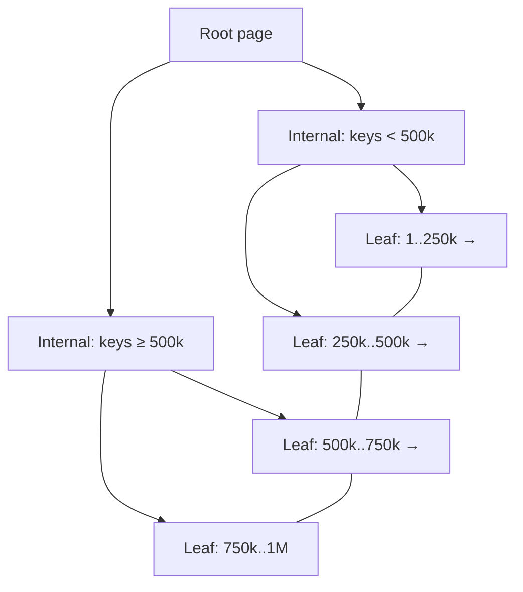

Without an index, `WHERE email = ?` scans every row — O(n) disk pages. An index is a separate, ordered structure mapping key → row location, turning that scan into an O(log n) descent.

## B+-trees, the default

Relational indexes are almost always **B+-trees**: high-fanout balanced trees (hundreds of children per node — nodes are disk-page-sized), so even billion-row tables are 3–4 levels deep. Leaves hold keys in sorted order and are linked — which is why B-trees serve not just equality but **range queries** (`BETWEEN`, `>`, `ORDER BY`, prefix `LIKE 'abc%'`).

**Hash indexes** beat B-trees slightly on pure equality but can't do ranges/ordering — that asymmetry is a favorite interview question.

## What indexing costs

Every index must be updated on every INSERT/UPDATE/DELETE of indexed columns — writes slow down, and indexes consume storage and cache. Index the columns your queries filter/join/sort on; don't index everything.

## The details that decide performance

- **Composite indexes & the leftmost-prefix rule.** An index on `(a, b, c)` serves filters on `a`, `(a,b)`, `(a,b,c)` — but not `b` alone. Order columns by: equality filters first, then the range/sort column.
- **Covering indexes.** If the index contains every column the query needs, the table lookup is skipped entirely (index-only scan) — often the single biggest cheap win.
- **Selectivity.** Indexes pay off on selective predicates. On a `status` column with 3 values, the planner will rightly ignore the index and scan (reading half the table via an index is *slower* than scanning it).
- **Why isn't my index used?** Function on the column (`LOWER(email) = …` needs an expression index), type mismatch, leading wildcard `LIKE '%x'`, low selectivity, or stale statistics. Always check with `EXPLAIN (ANALYZE)`.
- **Clustered vs secondary.** A clustered index *is* the table's physical order (InnoDB's PK; Postgres heaps + all-secondary instead). In InnoDB, secondary indexes point to PK values, so fat PKs bloat every index.

## Interview Q&A

**Q: Query is slow. Walk me through your process.**
A: `EXPLAIN ANALYZE` first — find the seq-scan or bad join. Check an index exists matching the predicate shape (leftmost prefix, no function wrapping). Consider covering the query. Verify statistics are fresh. Only then think schema/query rewrites. (Leading with EXPLAIN, not guessing, is the signal.)

**Q: Index on `(user_id, created_at)` — which queries does it serve?**
A: `WHERE user_id = ?` alone; `WHERE user_id = ? AND created_at > ?`; `WHERE user_id = ? ORDER BY created_at` (no sort needed). Not `WHERE created_at > ?` alone — leftmost-prefix rule.

**Q: Why B+-trees instead of binary search trees or hash tables?**
A: Disk. Page-sized nodes with fanout ~hundreds mean 3–4 I/Os to any key vs ~30 for a BST; sorted linked leaves give ranges and ordering, which hashes can't.

**Q: When would you *drop* an index?**
A: Unused (check pg_stat/sys views), duplicated by a composite's prefix, or on a write-hot table where its maintenance cost outweighs rare reads. Indexes aren't free — write amplification is real.

**Q: What's a partial index?**
A: An index over a filtered subset — `CREATE INDEX ... WHERE status = 'active'`. Tiny, hot, and perfect when queries only ever target that subset.
