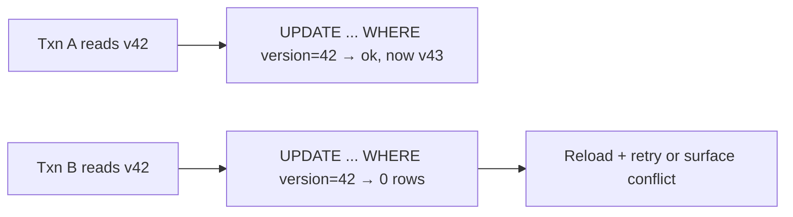

Perfect isolation (serializability) is expensive, so SQL defines levels that trade correctness for concurrency. Know the levels by **which anomaly each one eliminates**.

## Anomalies → levels

| Level | Dirty read | Non-repeatable read | Phantom read |
| --- | --- | --- | --- |
| Read Uncommitted | possible | possible | possible |
| Read Committed | ✗ | possible | possible |
| Repeatable Read | ✗ | ✗ | possible* |
| Serializable | ✗ | ✗ | ✗ |

- **Dirty read** — seeing another transaction's *uncommitted* write (which may roll back).
- **Non-repeatable read** — re-reading a row within one transaction and getting a different value (someone committed in between).
- **Phantom** — re-running a *range* query and seeing new rows appear.
- **Write skew** (the subtle one) — two transactions each read a condition, both act, and the combined result violates an invariant: two doctors both see "2 on call" and both go off duty. Only true serializability prevents it.

Defaults matter: Postgres and Oracle default to **Read Committed**; MySQL/InnoDB to **Repeatable Read**. (*Postgres's Repeatable Read is snapshot isolation — no phantoms, but write skew possible.)

## How databases implement it: MVCC

Modern engines use **multi-version concurrency control**: writers create new row versions instead of overwriting; readers see a consistent **snapshot** as of their start time. Result: **readers never block writers, writers never block readers** — the property that makes Read Committed/Snapshot cheap. Old versions are cleaned later (vacuum/purge). Writers conflicting on the *same row* still serialize via row locks.

## Optimistic vs pessimistic

- **Pessimistic** — take locks up front: `SELECT … FOR UPDATE` on the rows you'll modify. Right when conflicts are likely (inventory decrement, seat booking).
- **Optimistic** — no locks; validate at write time with a version column: `UPDATE … WHERE id = ? AND version = 42` — zero rows updated means someone beat you; retry. Right when conflicts are rare (typical web edits), and the only option across HTTP request boundaries.

## Interview Q&A

**Q: Two users decrement the same inventory count concurrently. What can go wrong at Read Committed, and fixes?**
A: Lost update: both read 5, both write 4. Fixes: atomic `UPDATE stock = stock - 1 WHERE stock > 0` (single statement), `SELECT FOR UPDATE`, or optimistic versioning. Reciting "raise the isolation level" alone is the weak answer — the atomic UPDATE is the strong one.

**Q: What does MVCC buy and what does it cost?**
A: Buys non-blocking reads (consistent snapshots) under concurrent writes. Costs: version bloat requiring vacuum/GC, and subtler anomalies (write skew) that snapshots don't prevent.

**Q: When do you actually choose Serializable?**
A: Invariants spanning multiple rows/queries that single-statement atomicity can't protect — scheduling constraints, balance invariants across rows. Modern SSI (Postgres) aborts conflicting transactions instead of locking everything, so the app must retry on serialization failures.

**Q: What is `SELECT FOR UPDATE` and its deadlock risk?**
A: It locks returned rows against concurrent modification until commit. Two transactions locking rows in opposite orders deadlock; the DB detects the cycle and kills one — so lock in consistent order and keep transactions short.

**Q: Why can't you hold a DB transaction across a user's think-time?**
A: Locks/snapshots held for seconds-to-minutes strangle concurrency and bloat versions. Use optimistic versioning across requests instead — read free, validate on save.
