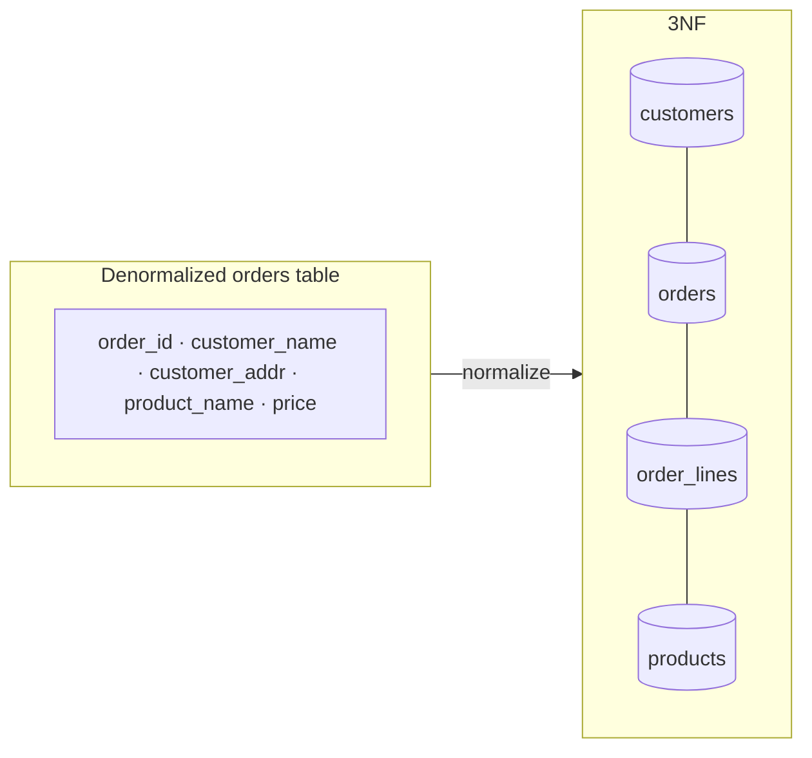

Normalization organizes tables so each fact lives in exactly one place. The payoff: no **update anomalies** (changing a customer's address in 47 order rows), no **insert anomalies** (can't add a course until a student enrolls), no **delete anomalies** (removing the last enrollment erases the course itself).

## The normal forms, practically

- **1NF** — atomic values: no comma-separated lists in a column, no repeating column groups (`phone1, phone2, phone3`). Lists become child tables.
- **2NF** — no partial dependency: with a composite key `(order_id, product_id)`, a column like `product_name` depends on only *part* of the key → move it to `products`.
- **3NF** — no transitive dependency: in `employees(id, dept_id, dept_name)`, `dept_name` depends on `dept_id`, not on the key → move it to `departments`. **"Every non-key column depends on the key, the whole key, and nothing but the key."** 3NF is the practical target.
- **BCNF** — 3NF with an edge case closed: *every* determinant must be a candidate key. Bites only in exotic composite-key designs; know it exists.

## Denormalization — the deliberate sin

Normalized schemas cost JOINs; at read-heavy scale you sometimes copy data on purpose: a `denormalized order_total` on orders, follower counts on profiles, or entire read-model tables. The rules for doing it honestly:

1. Denormalize for a **measured** read problem, not preemptively.
2. Every copy needs a **maintenance story** (trigger, transactional dual-write, or event-driven rebuild) — unmaintained copies drift and become data bugs.
3. Keep the normalized truth as the source; derived copies must be rebuildable.

Special case: **snapshot data is not denormalization**. `order_lines.price_at_purchase` duplicates `products.price` *correctly* — the order must record what was charged even when the catalog price changes later. Historical facts belong where they happened.

## Interview Q&A

**Q: Explain 3NF in one sentence and why we care.**
A: Non-key columns must depend only on the key — so every fact is stored once, making updates single-row and anomalies impossible.

**Q: Where would you deliberately break normalization?**
A: Hot aggregate reads: e.g. `post.like_count` instead of `COUNT(*)` per render, maintained by an atomic increment or async event — accepting eventual consistency of the counter for a 100× cheaper read.

**Q: Is storing `unit_price` on order lines a normalization violation?**
A: No — it's a point-in-time fact, distinct from the current catalog price. Confusing the two (joining orders to `products.price` for invoices) is a real-world billing bug.

**Q: How do you model many-to-many?**
A: A junction table (`student_courses(student_id, course_id, enrolled_at)`) with a composite PK/unique constraint and FKs both ways; relationship attributes live on the junction row.

**Q: Star schemas in analytics are denormalized — why is that OK there?**
A: OLAP workloads are read-only bulk scans where join cost dominates and update anomalies don't exist (data is loaded, not edited). Fact + dimension tables optimize for the actual access pattern — the same principle (design for your queries) that justifies 3NF in OLTP.
