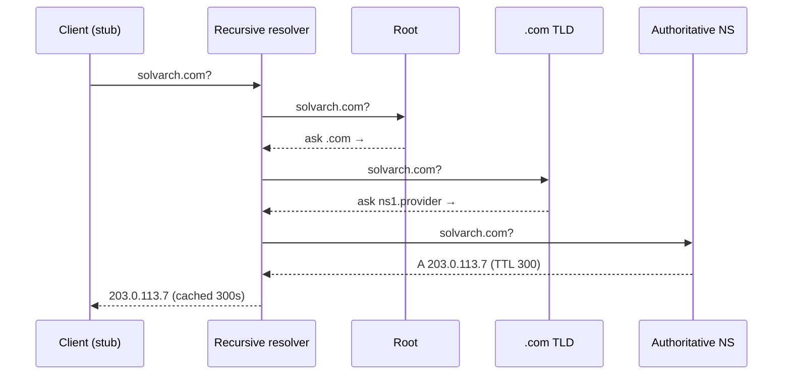

DNS translates names to addresses — a globally distributed, delegated, heavily cached database. It's also quietly a **traffic-management layer**: load balancing, failover, and CDN routing all hang off it.

## Resolution, end to end

Your device asks a **recursive resolver** (ISP, 1.1.1.1, 8.8.8.8). On cache miss, the resolver walks the hierarchy: **root** servers → **TLD** servers (.com) → the domain's **authoritative** servers, which hold the actual records. Every layer caches according to TTL, so the full walk is rare.

## Records you must know

| Record | Maps | Notes |
| --- | --- | --- |
| **A / AAAA** | name → IPv4 / IPv6 | The workhorses |
| **CNAME** | name → another name | Alias; illegal at the zone apex — hence provider ALIAS/ANAME hacks |
| **NS** | zone → authoritative servers | The delegation glue |
| **MX** | domain → mail servers | With priorities |
| **TXT** | name → arbitrary text | SPF/DKIM/DMARC, domain-ownership proofs |
| **SRV** | service → host:port | Service discovery (used inside Kubernetes, VoIP) |

## TTLs and the operational reality

TTL is the caching contract: 300s means changes propagate in ~5 minutes *to well-behaved resolvers* (some ignore TTLs). Playbook for a migration: lower TTL to 60s a day ahead, flip the record, raise TTL after. "DNS propagation takes 48 hours" is folklore about misbehaving caches, not the protocol.

**DNS as load balancer**: multiple A records round-robin across IPs; GeoDNS answers by client location (CDNs route you to the nearest PoP this way); health-checked DNS (Route 53) pulls dead IPs. Coarse — client caches mean failover is TTL-bounded — but it's the only balancer that works *before* any of your infrastructure is reached.

**Security notes**: plain DNS is unencrypted UDP/53 — your resolver (and path) sees every lookup; DoH/DoT encrypt it. DNSSEC signs records against forgery (cache poisoning) but is patchily deployed. DNS is also a common exfiltration channel (tunneling) — why security teams watch it.

## Interview Q&A

**Q: Recursive vs iterative queries?**
A: Your stub asks the resolver *recursively* ("get me the final answer"); the resolver queries root/TLD/authoritative *iteratively* ("who should I ask next?"). The resolver absorbs the work and amortizes it via caching.

**Q: Why can't the zone apex (example.com) be a CNAME, and why does it matter?**
A: A CNAME forbids coexisting records, but the apex must hold NS/SOA. It matters because pointing an apex at a CDN/load-balancer *hostname* is exactly what you want — providers work around it with ALIAS/ANAME records resolved server-side.

**Q: You flipped an A record and half your users still hit the old server an hour later. Why?**
A: Caches honoring the *old* TTL (resolver + OS + browser layers), some resolvers clamping/ignoring TTLs, and long-lived connections that never re-resolve. Mitigation is preparation: pre-lower TTLs, keep the old endpoint serving (or redirecting) during overlap.

**Q: How does a CDN use DNS to route you to a nearby edge?**
A: The CDN's authoritative server answers based on the *resolver's* location (or the EDNS client-subnet hint) with the IP of a nearby PoP, using short TTLs so routing can shift with load and failures.

**Q: Where does DNS-based failover fall short of a real load balancer?**
A: Granularity and speed — clients cache answers, so dead-IP eviction takes up to a TTL (plus misbehaving caches); no per-request balancing, no connection draining. It's coarse global steering; pair it with real LBs behind each IP.
