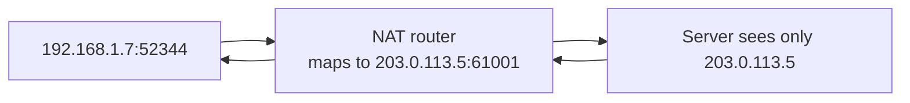

Addressing questions ("what's a /24?", "how does NAT work?") are quick filters for whether you've ever configured anything. The good news: the whole topic compresses into a few rules.

## CIDR in one paragraph

An IPv4 address is 32 bits. **CIDR notation** `10.1.2.0/24` says: the first 24 bits are the network prefix, the remaining 8 are host bits → 2⁸ = 256 addresses, of which 2 are reserved (network `.0` and broadcast `.255`) → **254 usable hosts**. The math you should do on sight:

| CIDR | Host bits | Addresses | Usable |
| --- | --- | --- | --- |
| /30 | 2 | 4 | 2 (point-to-point links) |
| /24 | 8 | 256 | 254 (the classic LAN) |
| /16 | 16 | 65,536 | 65,534 |
| /8 | 24 | 16.7M | — |

Subnetting is just borrowing host bits to split a network: a /24 splits into two /25s, four /26s… Cloud VPC design is exactly this exercise (a /16 VPC carved into /24 subnets per zone/tier).

Two addresses to recognize instantly: `0.0.0.0` ("all interfaces" when binding, "default route" as `0.0.0.0/0`) and `127.0.0.1` (loopback — never leaves the machine).

**Routing** follows **longest-prefix match**: a router picks the most specific route that covers the destination (a /24 route beats a /16 beats the default). One rule explains every routing table you'll ever read.

## Private ranges and NAT

RFC 1918 reserves three unroutable-on-the-internet blocks — `10.0.0.0/8`, `172.16.0.0/12`, `192.168.0.0/16`. Your home network and every cloud VPC live in them, which is what makes **NAT** necessary.

**How NAT actually works**: your router replaces the packet's private source `192.168.1.7:52344` with its public `203.0.113.5:61001` and records the mapping in a translation table. The reply hits the public pair, gets translated back, and delivered inward. This is NAPT/PAT — thousands of devices multiplexed over one public IP by port.

Consequences worth reciting:

- **Inbound connections don't work by default** — no table entry exists until *you* dial out. Hence port forwarding, and hence the entire hole-punching industry (STUN/TURN/ICE) that lets WebRTC/game clients behind two NATs meet.
- NAT is not a firewall, but it accidentally acts like one (unsolicited inbound dies).
- Servers see the NAT's IP — why "IP = user" breaks (a whole office is one IP) and why rate-limiting purely by IP misfires.
- **CGNAT**: ISPs now NAT entire neighborhoods (shared public IPs) — IPv4 exhaustion made NAT recursive.

## DHCP — how you got that address

On joining a network: **D**iscover (broadcast) → **O**ffer → **R**equest → **A**ck. The DHCP server leases you an IP, gateway, and DNS servers for a period. "DORA" is the expected mnemonic; static assignment/reservations exist for servers.

## IPv6 — the actual fix

128-bit addresses (`2001:db8::1`) — enough to end scarcity forever, killing NAT's original reason to exist (every device gets a real address; firewalls, not address shortage, provide the privacy). Adoption is ~half the internet; dual-stack (both protocols) is the deployment reality. Interview one-liner: *IPv6 restores end-to-end addressing; NAT survives out of inertia and as CGNAT.*

## Interview Q&A

**Q: How many usable hosts in a /26, and why minus two?**
A: 32−26 = 6 host bits → 64 addresses → 62 usable; the all-zeros host part names the network, all-ones is broadcast.

**Q: Two devices on one Wi-Fi both show the same public IP on whatismyip.com. Explain.**
A: They have distinct private RFC 1918 addresses; the router NATs both through its single public IP, distinguishing flows by translated source port.

**Q: Why can't a server on the internet initiate a TCP connection to my laptop?**
A: NAT has no translation entry for unsolicited inbound traffic — there's no mapping to my private address until my laptop creates one by connecting outward. Fixes: port forwarding, a relay (TURN), or hole punching.

**Q: A packet matches routes 10.0.0.0/8 and 10.1.2.0/24 — which wins?**
A: Longest prefix: the /24. Specificity beats generality; the default route 0.0.0.0/0 is just the least specific fallback.

**Q: You're designing a VPC — how do you carve subnets?**
A: Pick a comfortably-large private block (say 10.0.0.0/16), split into per-AZ, per-tier subnets (/24s: public/ingress, private/app, isolated/data), leaving unallocated space for growth. Never overlap with networks you might peer/VPN with — renumbering later is misery.
