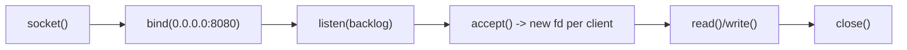

Every backend bug report eventually contains "connection refused", "address already in use", or "too many open files". This page is the theory behind those three strings — sockets as the OS API to networking.

## What a socket actually is

A socket is a **file descriptor** representing a communication endpoint — the kernel object your process reads/writes while the OS handles TCP/IP underneath. A TCP *connection* is identified by the **5-tuple**: (protocol, source IP, source port, destination IP, destination port). Change any element → different connection. This immediately explains:

- One server port serves thousands of clients simultaneously — each client arrives from a different (IP, port), so every 5-tuple is unique. **Port 443 is not "used up" by a connection.**
- A client can open multiple connections to the same server — each gets a fresh **ephemeral source port** (~32K–60K range, auto-assigned).
- Port limits bite *per direction*: one client machine hammering one server endpoint can exhaust its ~28K ephemeral ports — a real load-testing gotcha.

## The server lifecycle

The part people miss: **`accept()` returns a new socket per client**; the listening socket only takes new arrivals. A busy server holds one listening fd and N connection fds — which is why fd limits (`ulimit -n`, default often 1024) are the first wall a growing service hits ("too many open files").

`listen(backlog)` sizes the queue of completed-but-unaccepted connections; under overload the queue fills and new SYNs get dropped/refused — the polite word for it is backpressure.

## Decoding the classic errors

| Symptom | Meaning | Usual cause |
| --- | --- | --- |
| **Connection refused** | Host reachable, port closed — kernel answered with RST | Service down/crashed, wrong port, firewall REJECT |
| **Connection timed out** | Packets vanish, no answer at all | Firewall DROP, wrong IP/routing, host down |
| **Address already in use** | `bind()` failed | Another process on the port — or *your own* just-killed server's sockets in TIME_WAIT (fix: `SO_REUSEADDR`) |
| **Too many open files** | fd limit hit | Raise ulimit; find the leak (unclosed connections) |
| **Connection reset by peer** | RST mid-conversation | Peer crashed, or an idle middlebox/NAT dropped the mapping — hence keepalives |

Refused vs timeout is a genuinely diagnostic pair: refused proves the *host* is alive (something answered); timeout proves nothing is answering at all.

## TIME_WAIT — the interview favorite

After actively closing a connection, the closer's socket sits in **TIME_WAIT** for ~60s. It's not a bug — it guarantees stray delayed packets from the old connection die before a new connection reuses the same 5-tuple, and ensures the final ACK of teardown can be retransmitted. Consequences:

- A restarted server can't rebind its port while old sockets linger → every real server sets `SO_REUSEADDR`.
- A client churning short-lived connections (naive HTTP benchmarking) accumulates tens of thousands of TIME_WAIT sockets and runs out of ephemeral ports. Fix: **connection pooling / keep-alive** — which is also just better engineering.

## UDP sockets, briefly

No connection, no accept loop: `bind()` and then `recvfrom()` tells you each datagram's sender. One socket converses with the world. That simplicity (and no head-of-line blocking, no handshake) is why DNS, and QUIC underneath HTTP/3, ride UDP.

## Interview Q&A

**Q: How can nginx serve 100K concurrent users on one port?**
A: Connections are 5-tuples — every client's (IP, port) pair differs, so all coexist on server port 443. The real limits are fds, memory per connection, and the event loop's capacity — not port numbers.

**Q: `curl` returns "connection refused" — walk your diagnosis.**
A: Refused means an RST came back, so the machine is up and routable. Is the service running (`ps`)? Listening on the right interface/port (`ss -tlnp`)? Bound to 127.0.0.1 while I'm calling the public IP (the container/VM classic)? Firewall REJECT rule?

**Q: Why does a service bound to 127.0.0.1 work locally but not from other machines?**
A: Loopback binding accepts only same-host traffic. Bind 0.0.0.0 (all interfaces) or the specific NIC address to serve externally — the number-one Docker port-mapping confusion.

**Q: Your load generator plateaus at ~28K requests/sec with connection errors. What's happening?**
A: One client IP → one server endpoint exhausts ephemeral source ports, worsened by TIME_WAIT hoarding them. Fixes: keep-alive/pooling, multiple client IPs, tune port range.

**Q: What's the backlog and what happens when it overflows?**
A: The accept queue of completed handshakes waiting for the app. Overflow → kernel drops or refuses new connections; clients see timeouts/refused during overload even though the process is alive. Sizing it (and accepting fast) is basic server hygiene.
