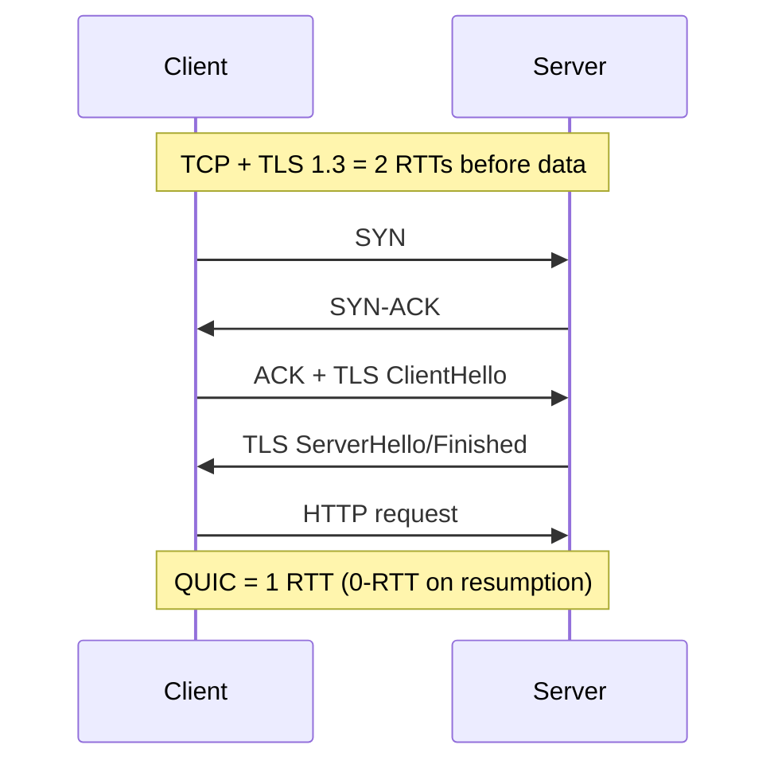

Both are transport-layer protocols multiplexed by **ports**. The difference is what they promise: TCP sells a **reliable, ordered byte stream**; UDP sells **raw datagrams** — send and hope.

## What TCP's promises cost

- **Connection setup** — the 3-way handshake (SYN → SYN-ACK → ACK): one full RTT before any data.
- **Reliability** — every byte is sequence-numbered and ACKed; lost segments retransmit (fast retransmit on duplicate ACKs, else timeout).
- **Ordering** — receivers buffer out-of-order segments; your app sees bytes in order. Corollary: one lost packet stalls everything behind it — **head-of-line blocking**.
- **Flow control** — the receiver advertises a window ("I can buffer this much") so it's never overrun.
- **Congestion control** — the sender probes the *network's* capacity (slow start → congestion avoidance; halve on loss). This is why throughput ramps up over a connection's life and why short connections never reach full speed.

## UDP: the escape hatch

No handshake, no retransmission, no ordering, no congestion control — just a destination and a payload. You use it when the *application* has better answers than TCP's defaults:

- **Real-time media/gaming** — a retransmitted packet arrives too late to matter; better to skip than stall.
- **DNS** — one tiny query/response; a handshake would triple the cost.
- **Build-your-own** — QUIC (below).

| | TCP | UDP |
| --- | --- | --- |
| Setup | 1 RTT handshake | none |
| Delivery | reliable, ordered | best-effort |
| HOL blocking | yes | no |
| Congestion control | built in | yours to add |
| Typical uses | HTTP(S), DBs, SSH | DNS, VoIP, games, QUIC |

## QUIC — why HTTP/3 left TCP

QUIC rebuilds transport **on top of UDP**: TLS 1.3 baked into the handshake (0–1 RTT total vs TCP+TLS's 2–3), **independent streams** so one lost packet stalls only its own stream (killing HOL blocking that plagued HTTP/2-over-TCP), and connection IDs that survive IP changes (Wi-Fi → cellular without reconnecting). It exists because TCP is ossified — middleboxes freeze its evolution — while UDP is a blank canvas.

## Interview Q&A

**Q: Why does TCP need a 3-way handshake, not 2?**
A: Both sides must confirm the *other's* sequence number to establish a duplex stream: SYN proposes client's ISN, SYN-ACK acknowledges it and proposes the server's, final ACK confirms the server's. Two ways would leave the server unsure its ISN was received (and invites forged-connection attacks).

**Q: Flow control vs congestion control?**
A: Flow control protects the **receiver** (advertised window = its buffer space). Congestion control protects the **network** (sender infers capacity from loss/delay). A sender transmits min(both windows).

**Q: What is head-of-line blocking and where does it bite?**
A: In-order delivery means a lost segment blocks delivery of everything after it. Over HTTP/2, all multiplexed requests share one TCP stream — one loss stalls all of them. QUIC's per-stream reliability is the fix.

**Q: Video call: TCP or UDP, and why?**
A: UDP (with RTP on top). A frame retransmitted 300ms later is useless — you'd rather drop it and show the next one. TCP would insist on delivering it anyway, stalling live audio behind stale data.

**Q: How does a TCP connection close, and what's TIME_WAIT for?**
A: FIN/ACK in each direction (half-close allowed). The side closing first holds TIME_WAIT (~2×MSL) so late duplicates die and the final ACK can be retransmitted — why servers churning connections exhaust ports without `SO_REUSEADDR`/tuning.
