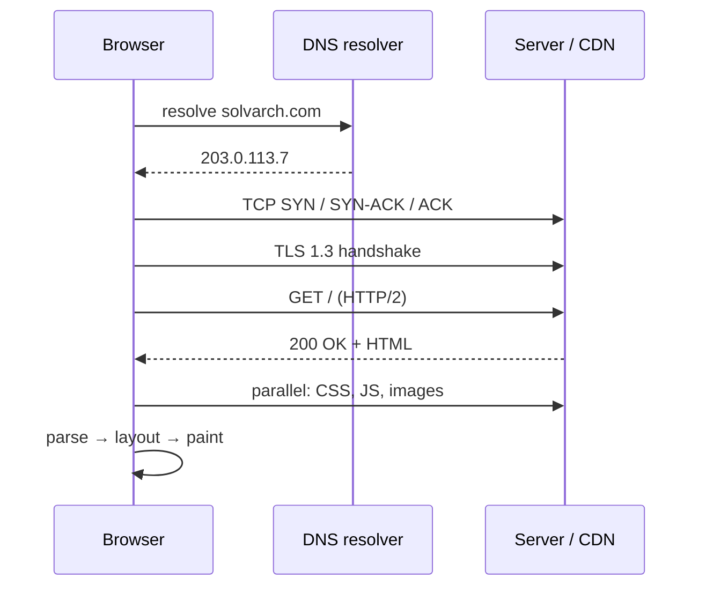

The most-asked networking question because it touches every layer. Deliver it as a crisp storyline, then let the interviewer pick where to zoom.

## The storyline

1. **Parse & pre-checks.** Browser parses the URL, checks HSTS (force HTTPS), and looks for the answer in its own caches first.
2. **DNS.** Browser cache → OS cache → recursive resolver → (miss) root → TLD → authoritative → A/AAAA record, cached per TTL. *(Details: the DNS guide.)*
3. **TCP.** Three-way handshake with the resolved IP on port 443 — one RTT. (HTTP/3 skips this: QUIC over UDP.)
4. **TLS.** TLS 1.3 handshake: certificate validation, key exchange — one more RTT (0-RTT on resumption). *(Details: HTTP & HTTPS guide.)*
5. **Request.** `GET / HTTP/2` with headers + cookies. On the far side, this likely traverses: CDN edge → load balancer → app servers → caches/databases.
6. **Response.** Status + headers + HTML, possibly compressed (gzip/brotli), possibly straight from a CDN cache.
7. **Parse & fetch subresources.** HTML parsing discovers CSS/JS/images/fonts → repeat DNS/TLS/fetch (connection reuse and HTTP/2 multiplexing make this cheap; preload hints reorder it).
8. **Render.** DOM + CSSOM → render tree → layout → paint → composite. JS execution can block parsing (`defer`/`async` exist for this). Page becomes interactive when the main thread is free.

## Where they zoom in (be ready)

- **"Where can this be slow?"** — RTT count before first byte (DNS + TCP + TLS = up to 3 RTTs; QUIC/resumption/preconnect cut them), server time, render-blocking JS/CSS. Tie each to a fix.
- **"Where are the caches?"** — browser HTTP cache, DNS caches at 3+ layers, CDN edge, server-side caches, DB caches. Naming five cache locations in one breath is a strong moment.
- **ARP/routing depth** — within the local network: default gateway via ARP, NAT at the router, BGP-routed hops across ASes to the destination. Mention you *can* go there; don't unless invited.
- **Security depth** — HSTS, cert validation, mixed-content blocking, cookie flags, CSP on the response.

## Interview Q&A

**Q: How many round trips before the first byte of HTML, cold?**
A: Classic stack: DNS (≈1, often cached) + TCP (1) + TLS 1.3 (1) + request/response (1) ≈ 3–4 RTTs. HTTP/3 collapses transport+TLS to 1; session resumption and CDN proximity shrink the rest — why edge presence matters more than server speed for TTFB.

**Q: The URL resolves but the page hangs forever. Diagnose.**
A: Split the path: `dig` (DNS ok?) → `curl -v` (TCP connect? TLS? HTTP status?) → if connect hangs: firewall/security group; TLS error: certs; 5xx: server side; response fine in curl but browser hangs: front-end/JS. Binary-search the layers, tool per layer.

**Q: First visit vs second visit — what changes?**
A: Second visit: DNS cached, connection possibly still open (keep-alive), TLS session resumed (0/1-RTT), assets served from browser cache (or 304-revalidated), CDN already warm. From ~4 RTTs + full payload down to ~1 RTT + deltas.

**Q: Where does a CDN insert itself in this flow?**
A: At DNS — the hostname resolves to the CDN edge's IP (geo-answered). The edge terminates TCP/TLS near the user, serves cache hits directly, and proxies misses to origin over warm connections.
