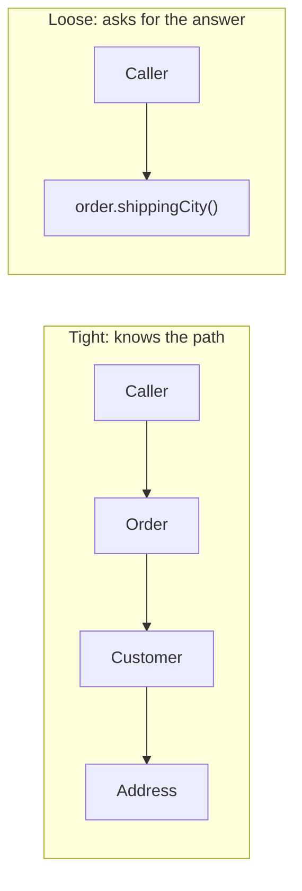

Nearly every design principle — SOLID, "composition over inheritance", microservice boundaries — compresses to one sentence: **low coupling, high cohesion**. Interviewers ask about it directly, and every "is this good design?" question is secretly asking it.

## Cohesion: does this module have one job?

Cohesion measures how strongly a module's contents belong together. High cohesion: everything in `InvoiceCalculator` is about calculating invoices. Low cohesion: the 3,000-line `Utils` class, or a `UserManager` doing validation + persistence + emailing + report formatting.

The smell tests:

- Can you name the class without "Manager/Helper/Util/Processor"? Vague name → vague responsibility.
- Do different methods use disjoint subsets of the fields? That's two classes sharing a roof (low cohesion's formal definition — LCOM metrics measure exactly this).
- Does it change for multiple unrelated reasons? That's the Single Responsibility Principle — SRP *is* cohesion, stated as change-reasons.

## Coupling: how much does this module know about others?

Coupling measures how entangled modules are — how far a change ripples. The useful ranking, tightest (worst) to loosest:

1. **Content coupling** — reaching into another module's internals (`order.items.list[0].price = 0`). Any internal change breaks you.
2. **Common coupling** — sharing mutable global state. Everyone's a suspect for every bug.
3. **Control coupling** — passing flags that steer another module's logic (`render(data, isAdminMode=true)`) — the caller knows the callee's insides.
4. **Stamp coupling** — passing a fat object where three fields were needed; the signature lies about the dependency.
5. **Data coupling** — passing exactly what's needed. Healthy.
6. **Message coupling** — interacting only through interfaces/events. Loosest.

You can't reach zero coupling — collaborating code must touch. The goal is coupling to **stable abstractions** (interfaces, contracts) instead of volatile details — which is Dependency Inversion in one clause.

## The Law of Demeter — coupling's lint rule

"Talk to friends, not strangers": `order.getCustomer().getAddress().getCity()` chains through three objects' internals — a change to any link breaks the caller. Prefer `order.getShippingCity()` — tell the object what you need, don't navigate its guts. (Fluent builders and data-only structures are accepted exceptions; the law targets *object graphs*, not DTOs.)

## How they trade against each other

Splitting one low-cohesion class into five can *create* coupling if the five must constantly whisper to each other — you've cut along the wrong seam. Good boundaries put things that **change together, together** (that phrase is the common-closure principle, and the same rule that decides microservice boundaries: services chronically deployed in lockstep are one service wearing two costumes — a "distributed monolith").

Practical heuristics that show seniority:

- Depend on interfaces at module boundaries; concrete types are fine within them. (Interfaces everywhere is its own disease.)
- Watch the *fan-out* of a change: "if I rename this field, how many files move?" is coupling measured empirically.
- Constructor injection makes coupling visible — a constructor with nine dependencies is a cohesion alarm ringing.

## Interview Q&A

**Q: Define coupling and cohesion in one line each.**
A: Cohesion — how much a module's insides belong together (want high). Coupling — how much modules depend on each other's details (want low). Good design maximizes the first to naturally reduce the second.

**Q: How does SOLID relate to these two words?**
A: SRP = cohesion. OCP/LSP/ISP/DIP are four coupling-reduction tactics: extend without modifying, substitutable abstractions, thin interfaces, depend on abstractions. The principles are the words operationalized.

**Q: Concrete refactor for `user.getWallet().getBalance().getAmount() > 100`?**
A: Demeter violation — add `user.canAfford(amount)`. The wallet's structure becomes private again; the business question is answered where the data lives.

**Q: When would you accept tighter coupling on purpose?**
A: Within a cohesive module (private classes may know each other well), for performance-critical paths where indirection costs, or in small stable code where an abstraction layer is speculative generality — YAGNI beats purity until change actually arrives.

**Q: How do these concepts decide microservice boundaries?**
A: Same math at network scale: a service should be internally cohesive (one business capability) and loosely coupled to peers (API/events, no shared database). If two services always change and deploy together, the boundary is wrong — merge them.
