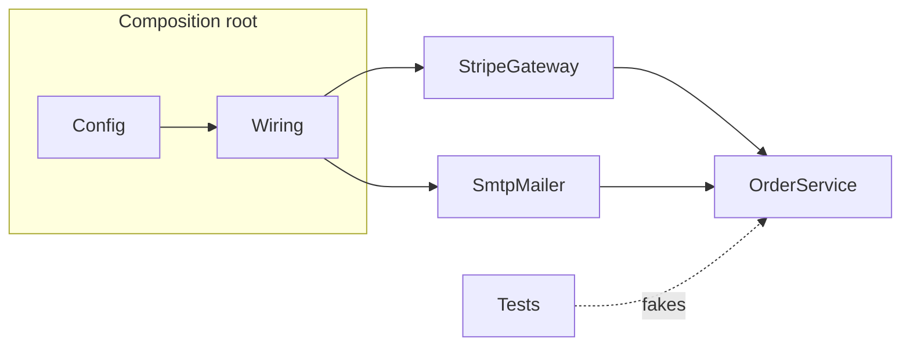

"How would you make this testable?" — the answer is almost always dependency injection. DI is Dependency Inversion (the D in SOLID) turned into a concrete coding habit, and it's the most job-relevant OOP topic there is.

## The problem: `new` hardwires decisions

```java
class OrderService {
    private final StripeClient payments = new StripeClient(API_KEY); // decided here, forever
    private final SmtpMailer mailer = new SmtpMailer("smtp.internal");

    void checkout(Order o) { payments.charge(o); mailer.sendReceipt(o); }
}
```

`OrderService` chose its collaborators' *concrete types*, their configuration, and their lifetimes. Consequences: you cannot unit test `checkout` without hitting Stripe and an SMTP server; you cannot swap providers without editing this class; and the dependencies are invisible from outside — the class lies about what it needs.

## The fix: dependencies come in through the front door

```java
class OrderService {
    private final PaymentGateway payments;   // interface
    private final Mailer mailer;             // interface

    OrderService(PaymentGateway payments, Mailer mailer) {  // injected
        this.payments = payments;
        this.mailer = mailer;
    }
}
```

Two moves happened: depend on **abstractions** (interfaces), and receive them **from outside** (constructor). Now tests pass fakes (`new OrderService(fakeGateway, recordingMailer)`), production passes real adapters, and the constructor honestly documents every dependency. That honesty is a feature: a constructor demanding nine collaborators is a class confessing low cohesion.

**Injection flavors**: constructor (the default — dependencies immutable, mandatory, visible), setter (optional/reconfigurable dependencies; risks half-initialized objects), field/annotation injection (concise but hides dependencies and blocks manual construction — least recommended, framework docs agree).

## Inversion of Control and "the container"

If classes don't build their dependencies, someone must. That someone is the **composition root** — the one place (in `main()`) where the object graph is wired:

```java
var mailer   = new SmtpMailer(config.smtp());
var payments = new StripeGateway(config.stripeKey());
var orders   = new OrderService(payments, mailer);
```

This is *pure DI* — no framework, and for interviews it's the answer that shows understanding. DI **containers** (Spring, NestJS, .NET Core, Dagger) automate the same wiring: you register `PaymentGateway → StripeGateway`, and the container reflects over constructors, resolves the graph, and manages **lifetimes/scopes** — singleton (one instance), request-scoped (per HTTP request), transient (new each time). The framework is convenience and lifecycle management; the design principle works without it.



## Judgment: where DI earns it and where it's noise

- Inject things with **side effects, configuration, or multiple implementations**: clocks (`Clock` injection makes time-dependent logic testable — the classic example), databases, HTTP clients, feature flags, random number generators.
- Don't inject value objects, collections, or pure functions — `new ArrayList()` is not a design decision.
- Interfaces with exactly one production implementation are fine *when the second implementation is the test fake* — that's already two.
- Service locator (`Container.get(Mailer.class)` inside the class) is DI's evil twin: dependencies become invisible again and the container leaks everywhere. Constructor injection keeps the class framework-agnostic.

## Interview Q&A

**Q: DI vs IoC vs DIP — untangle the acronyms.**
A: DIP (principle): depend on abstractions, not concretions. IoC (pattern): object construction/control moves out of the class to a composition root or container. DI (technique): dependencies handed in via constructor/setter. DI implements IoC which serves DIP.

**Q: How does DI make code testable, mechanically?**
A: Collaborators arrive as interfaces, so tests substitute controlled fakes/mocks — no network, no clock, no database. The unit under test runs in isolation with scripted collaborator behavior and observable outputs.

**Q: Do you need Spring/NestJS to do DI?**
A: No — constructor injection plus a hand-written composition root is complete DI. Frameworks add auto-wiring and scope management, worth it as graphs grow; the principle is framework-free.

**Q: What are the downsides of DI containers?**
A: Wiring errors move from compile time to startup/runtime; stack traces and control flow get harder to follow; over-abstraction breeds interface ceremony; and misused scopes (a request-scoped bean captured by a singleton) create subtle bugs. Pure DI in small apps is often clearer.

**Q: Why is `LocalDate.now()` inside business logic a testability bug, and the fix?**
A: It's a hidden dependency on the system clock — tests can't control "today", so date-boundary logic is untestable and flaky. Inject `Clock` (or a `TimeProvider`), pass fixed clocks in tests.
