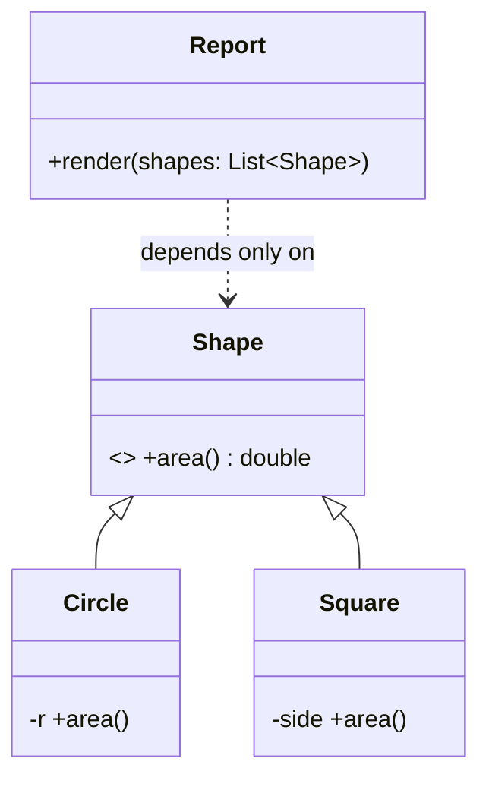

Every OOP interview starts here. The trap is reciting definitions; the win is showing *why each exists* and where they differ.

## Encapsulation

Bundle state with the methods that maintain it, and **hide the representation** behind an interface. `account.balance -= x` from outside is a bug factory; `account.withdraw(x)` can enforce invariants (sufficient funds, audit log) in one place.

The point isn't `private` for its own sake — it's **invariant protection**: no external code can put the object into an illegal state, so you can reason about correctness locally.

## Abstraction

Expose *what* an operation does, hide *how*. `list.sort()` doesn't reveal Timsort; `payment.charge()` doesn't reveal Stripe. Abstraction is what lets you swap implementations and think in domain terms.

**Encapsulation vs abstraction** (perennial question): encapsulation hides *internal state* (data protection); abstraction hides *complexity* (a simpler mental model). Encapsulation is a technique; abstraction is a design act — choosing which concepts exist at all.

## Inheritance

`Dog extends Animal`: reuse + an **is-a** contract. The subtlety interviews probe: inheritance is the *strongest* coupling in OOP — subclasses depend on parent internals (the fragile base class problem), and hierarchies rigidify. It's the right tool when a true is-a relationship exists *and* you want polymorphic dispatch; otherwise prefer composition (see the dedicated guide).

## Polymorphism

One interface, many behaviors: code that calls `shape.area()` works for circles and squares that don't exist yet. This is the pillar that eliminates type-switches (`if shape is Circle…`) and enables the Open/Closed Principle — extension by adding classes rather than editing dispatch tables.

## Interview Q&A

**Q: Encapsulation vs abstraction in one line each?**
A: Encapsulation: outsiders can't touch my internals (state hiding + invariants). Abstraction: outsiders don't *need* to know my internals (complexity hiding via interfaces).

**Q: Give a concrete invariant encapsulation protects.**
A: `BankAccount.withdraw()` guaranteeing balance never goes negative — impossible to enforce if `balance` is public, trivial if all mutation flows through the method.

**Q: Why is polymorphism the pillar that matters most for large codebases?**
A: It inverts dependencies: high-level code depends on stable interfaces while variation lives in leaf classes. New behavior = new class, zero edits to existing call sites — the difference between O(1) and O(n) change cost.

**Q: Overloading vs overriding?**
A: Overloading: same name, different parameter lists, resolved at *compile time* — convenience, not polymorphism. Overriding: subclass replaces a parent's method, resolved at *runtime* via dynamic dispatch — actual polymorphism.

**Q: Can you have OOP without inheritance?**
A: Largely yes — Go and Rust do: encapsulation + interfaces + composition deliver polymorphism without implementation inheritance. That inheritance is the *optional* pillar is itself a strong interview answer.
