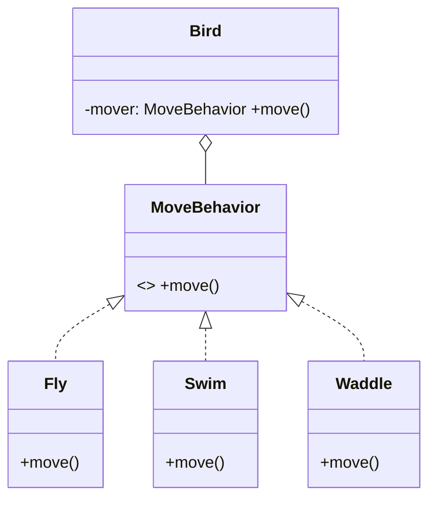

Both reuse code. **Inheritance** says *is-a* (`Car extends Vehicle`); **composition** says *has-a* (`Car` has an `Engine`). The industry's hard-won default: **favor composition** — reach for inheritance only when its specific superpowers are needed.

## Why inheritance goes wrong

- **Fragile base class.** Subclasses see and depend on parent internals (protected fields, call order between methods). A "safe" parent refactor breaks children in other files/teams. Composition interacts only through public interfaces.
- **Taxonomy rigidity.** `Penguin extends Bird` inherits `fly()` — now what? Real domains refuse clean trees (the penguin problem). And single inheritance forces one axis: `AmphibiousVehicle` can't extend both `LandVehicle` and `WaterVehicle`, but it can *compose* both drive modes.
- **Static, whole-package reuse.** You inherit everything, at compile time, forever. Composition picks parts and can swap them at runtime (`car.setEngine(electric)`).
- **The banana-gorilla-jungle problem** (Joe Armstrong's line): you wanted a banana; inheritance handed you the gorilla holding it and the entire jungle.

## Composition + interfaces = the modern pattern

Model *capabilities* as interfaces and inject implementations:

`Penguin` composes `Swim` + `Waddle`; `Eagle` composes `Fly`. No dead `fly()` methods, no hierarchy surgery when a flying fish shows up. (This is the Strategy pattern — composition's poster child.)

## Where inheritance still earns its place

- **Genuine is-a with a stable contract**: exceptions (`TimeoutError extends NetworkError` — catch hierarchies), AST nodes, UI widget bases.
- **Template Method**: a base class owns an algorithm skeleton; subclasses fill in steps. (Even this is often replaceable by injected functions.)
- **Framework integration points** the framework mandates.

Litmus test: would you ever pass the child where the parent is expected *and rely on substitutability*? If you only want the code reuse, compose instead — private inheritance of behavior is what fields are for.

## Interview Q&A

**Q: "Favor composition over inheritance" — steelman both sides.**
A: Composition: weaker coupling (public interfaces only), runtime flexibility, multiple capabilities, no fragile base class. Inheritance: true is-a polymorphism with less boilerplate, natural catch/dispatch hierarchies. The heuristic isn't "never inherit" — it's "inherit for substitutability, compose for reuse."

**Q: Design vehicles: land, water, amphibious. Go.**
A: Compose capabilities: `Vehicle` has `Set<TerrainMode>` (or `DriveBehavior` strategies for land/water). Amphibious = both modes. An inheritance tree dead-ends immediately on the amphibious case — say that out loud, it's the point of the question.

**Q: What breaks when you subclass a class you don't own (e.g. a library's HashMap)?**
A: You're coupled to its internals: if the library changes self-call patterns (put calling putAll or not), your overrides silently misfire. The safe pattern is a wrapper (composition + delegation) exposing only your interface — see `InstrumentedHashMap` in Effective Java.

**Q: Is a Stack that extends ArrayList good design?**
A: No — Stack *has* storage, it isn't a list: inheriting exposes `get(i)`/`insert(i)` that violate LIFO invariants. Compose a private list, expose push/pop/peek. (Java's real `Stack extends Vector` is the canonical cautionary tale.)
