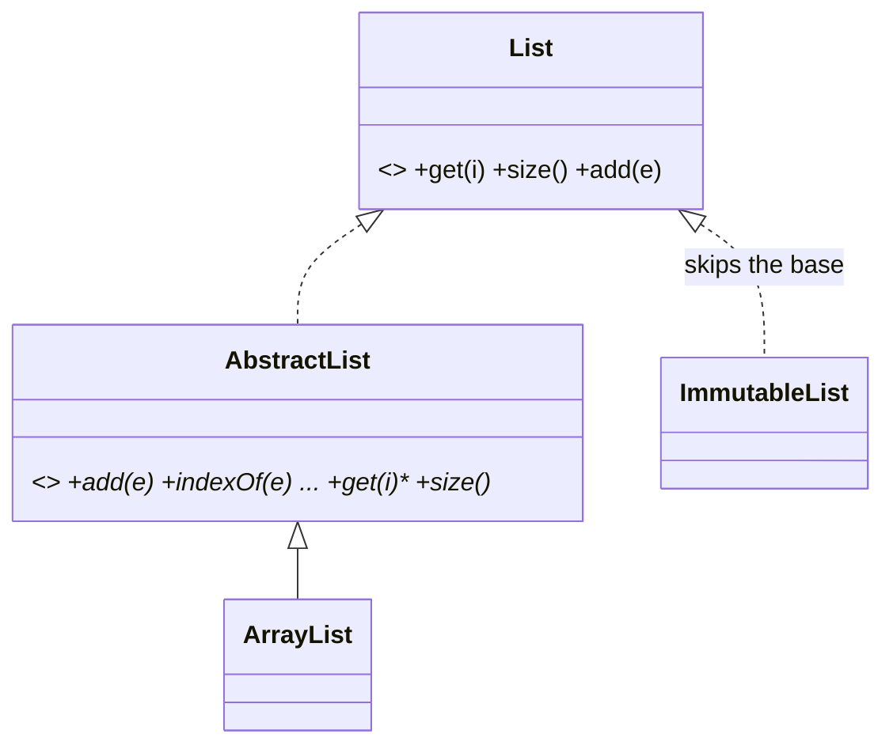

Both define types you can't instantiate; the difference is intent. An **interface** is a pure *contract*: what you can do (`Comparable`, `Serializable`, `PaymentProvider`). An **abstract class** is a *partial implementation*: shared state + code with designated gaps (`AbstractList` implements almost everything atop `get()` and `size()`).

## The practical differences

| | Interface | Abstract class |
| --- | --- | --- |
| State (fields) | No instance state | Yes — fields, constructors |
| Implementation | Default methods only (no state to use) | Full methods + protected helpers |
| Multiplicity | Implement many | Extend one (Java/C#) |
| Relationship | *can-do* (capability) | *is-a* (family membership) |
| Evolution | Adding methods breaks implementors (pre-defaults) | Add a concrete method freely |

The one-vs-many rule is the big architectural lever: a class can be `Comparable` *and* `Serializable` *and* `Closeable` — capabilities stack. It can only be one `AbstractVehicle`.

## Choosing

- Defining what something can *do*, especially across unrelated classes → **interface**. (`Walkable`, `Cacheable`, `EventHandler`.)
- Sharing real code and state among closely related classes → **abstract class** as the family's spine.
- The strongest pattern combines them: **interface for the public contract, abstract class as an optional convenience base** — `List` (interface) + `AbstractList` (skeleton). Callers depend on the interface; implementors may shortcut via the base.

**Default methods** (Java 8+) let interfaces carry behavior — added so `Collection` could gain `stream()` without breaking every implementor. They blur the line but not the core distinction: interfaces still can't hold instance state, so anything stateful stays in classes.

## Interview Q&A

**Q: When would you pick an abstract class over an interface?**
A: When implementations share *state and code*: a `BaseRepository` holding the connection and transaction helpers, with subclasses supplying entity-specific queries. A contract alone can't carry that.

**Q: Why do languages allow implementing many interfaces but extending one class?**
A: The diamond problem: two parents providing *state and implementation* for the same member create ambiguity (whose field? whose method?). Contracts don't collide — agreeing to two promises is fine; inheriting two bodies isn't. (Default-method conflicts must be resolved explicitly by the implementor.)

**Q: Design a plugin system — interface or abstract class?**
A: Interface for the plugin contract (`init/execute/teardown`) so third parties aren't forced into your hierarchy; *optionally* ship an abstract convenience base implementing boilerplate. Contract and convenience are separate deliverables.

**Q: What breaks when you add a method to a widely-implemented interface, and the fixes?**
A: Every implementor fails to compile (or at runtime for dynamic languages). Fixes: default method with sensible fallback, a new extending interface (`Foo2`), or version the API. This evolution pain is why interfaces should be small (ISP).

**Q: Why "program to interfaces, not implementations"?**
A: Call sites depending on `List`, not `ArrayList`, can swap implementations (test fakes, immutables, adapters) with zero edits — the enabling move for DIP and for mocking in tests.
