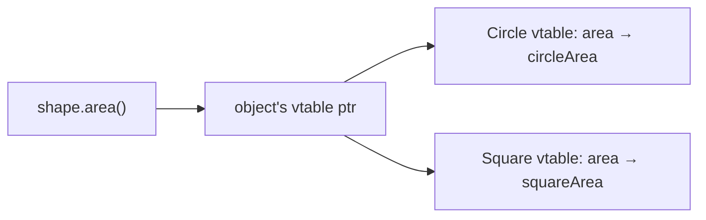

Polymorphism = one call site, many behaviors. Interviews test whether you know the *kinds*, the *mechanics*, and the *design consequence* (killing type-switches).

## The kinds

- **Subtype (runtime)** — `shape.area()` dispatches to Circle's or Square's override at runtime. The one people mean by default.
- **Parametric (generics)** — `List<T>` works uniformly for any T; the *code* is polymorphic, no dispatch involved.
- **Ad-hoc (overloading)** — same name, different signatures, resolved at **compile time** by static argument types. Convenient, but not dynamic dispatch — a classic trick question.

## How dynamic dispatch actually works

Each class with virtual methods has a **vtable**: an array of function pointers, one slot per virtual method. Every object carries a hidden pointer to its class's vtable. `shape.area()` compiles to: follow the object's vtable pointer → jump through the `area` slot. Overriding = the subclass's vtable holds a different pointer in that slot.

Costs and consequences worth knowing: one extra indirection (near-free, though it can inhibit inlining and branch prediction); C++ makes dispatch opt-in (`virtual`), Java methods are virtual by default (`final` opts out and helps the JIT devirtualize); dynamic languages dispatch by name lookup (duck typing) — same idea, hash lookup instead of table index.

**Static vs dynamic type**: in `Animal a = new Dog()`, the compiler checks calls against `Animal` (static type), but execution dispatches to `Dog`'s overrides (dynamic type). Fields and overloads bind statically; overridden methods bind dynamically — most polymorphism quiz questions are exactly this distinction.

## The design consequence

Type-switches are the smell polymorphism exists to remove:

```java
// Smell: every new shape edits this function (and its 12 siblings)
double area(Shape s) {
  if (s instanceof Circle c) return PI * c.r * c.r;
  if (s instanceof Square q) return q.side * q.side;
  ...
}
```

Move the behavior *into* the types (`s.area()`), and adding `Triangle` touches one new file — Open/Closed in action. The exception: when operations vary more often than types (compilers, interpreters), the **Visitor pattern** (double dispatch) flips the axis deliberately — knowing *when* each direction wins is senior-level signal.



## Interview Q&A

**Q: Overloading vs overriding — who decides, and when?**
A: Overloading: compiler, at compile time, by static argument types. Overriding: runtime, by the object's dynamic type via the vtable. `print(Animal)` vs `print(Dog)` overloads pick by the *variable's* type, not the object's — the classic gotcha.

**Q: Why can't constructors (or static methods) be virtual?**
A: Dispatch needs an object's vtable pointer — during construction the object doesn't fully exist yet (and statics have no object at all). Related trap: calling a virtual method *inside* a constructor runs the base version in C++ and the (dangerously uninitialized) override in Java.

**Q: What is double dispatch and when do you need it?**
A: Selecting behavior by *two* runtime types (collision(Asteroid, Ship)). Single dispatch only sees the receiver, so you bounce: `a.collideWith(b)` → `b.collideWithAsteroid(a)`. Visitor is this pattern industrialized — right when operations over a stable type family change often.

**Q: How do generics differ from subtype polymorphism in what they guarantee?**
A: Generics give *uniform* behavior with compile-time type safety and zero dispatch (`sort(List<T>)` treats every T identically). Subtyping gives *varying* behavior per type at runtime. They compose: `max(List<T extends Comparable<T>>)` uses both.

**Q: A `Bird` interface has `fly()`, and `Penguin` implements it by throwing. What principle is violated and what's the fix?**
A: Liskov Substitution — code holding a `Bird` can no longer call `fly()` safely. Fix the model: split `Flyable` out, or compose movement strategies (see inheritance vs composition). LSP violations almost always mean the taxonomy is wrong, not the code.
