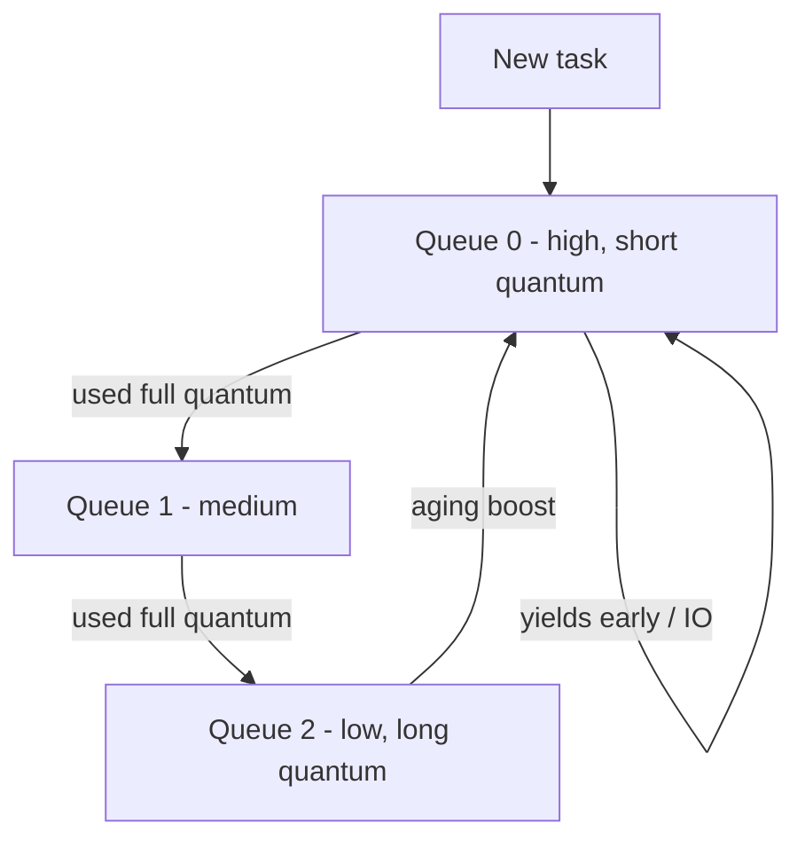

The scheduler multiplexes N runnable threads onto M cores. Every design optimizes some mix of **throughput** (work/sec), **turnaround** (submit→finish), **response time** (submit→first output), and **fairness** — and you can't max all four at once.

**Preemptive vs cooperative**: preemptive schedulers interrupt tasks on a timer (all modern OSes — one hostile loop can't freeze the machine); cooperative ones wait for tasks to yield (embedded systems, JS event loop — one long callback stalls everything).

## The classic algorithms

- **FCFS** — run in arrival order. Simple; the **convoy effect** (one long job queues everyone behind it) wrecks response time.
- **SJF / SRTF** — shortest job (or shortest *remaining* time) first. Provably optimal average waiting time; unusable directly because run times aren't known — and long jobs can **starve**. Real schedulers approximate it by predicting from past behavior.
- **Round Robin** — FIFO + a time quantum; expired tasks go to the back. Great response time. Quantum too small → switch overhead dominates; too large → degenerates to FCFS.
- **Priority** — highest priority runs; starvation fixed with **aging** (waiting tasks gain priority). Beware **priority inversion**: a low-priority task holding a lock a high-priority task needs, while medium-priority tasks preempt the low one — famously stalled Mars Pathfinder. Fix: priority inheritance (the lock holder temporarily borrows the waiter's priority).
- **MLFQ (multi-level feedback queue)** — multiple RR queues by priority; new tasks start high, CPU-hogs sink, I/O-bound tasks stay high (they yield before the quantum expires). Approximates SJF without predictions — the conceptual basis of most real desktop/server schedulers. Linux's CFS instead tracks per-task virtual runtime and always runs the task with the least, giving weighted fairness.

## Interview Q&A

**Q: Why do I/O-bound tasks deserve (and get) higher effective priority?**
A: They use the CPU briefly then block, so running them first costs little and keeps devices busy and interfaces responsive. MLFQ delivers this automatically — they never exhaust their quantum, so they never sink.

**Q: What exactly happens on a timer interrupt?**
A: Hardware traps into the kernel, the current task's context is saved into its PCB/TCB, the scheduler picks the next task (per its policy), and that task's context is restored — the mechanism that makes preemption possible.

**Q: RR with quantum 4ms vs 4s — what changes?**
A: 4ms: snappy interactivity, but switch overhead (µs each, plus cache/TLB pollution) eats a visible fraction of CPU. 4s: near-zero overhead but terrible response time. Real systems: ~1–10ms, often dynamic.

**Q: How would you schedule on a web server so long requests don't hurt short ones?**
A: Same MLFQ insight at the application layer: separate fast/slow pools or queues, cap concurrency per class, and time-limit handlers. (Recognizing scheduling ideas outside the kernel is what this question is really testing.)

**Q: What is starvation and name two fixes.**
A: A runnable task waits unboundedly because higher-priority work always exists. Fixes: aging (priority grows with wait time) or fairness-based scheduling (CFS's virtual runtime guarantees everyone progresses).
