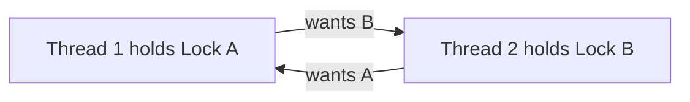

A **deadlock** is a set of threads/processes each waiting for a resource held by another member of the set — a cycle of waiting that no one can break. Nothing crashes; everything simply stops. That silence is what makes deadlocks nastier than exceptions.

## The four Coffman conditions

Deadlock is possible **only if all four** hold simultaneously — which means breaking any one of them is a complete cure:

1. **Mutual exclusion** — resources can't be shared (a lock has one owner).
2. **Hold and wait** — a thread holds one resource while waiting for another.
3. **No preemption** — resources can't be forcibly taken away.
4. **Circular wait** — a cycle: T1 waits on T2's resource, T2 on T3's, … Tn on T1's.

## The three strategies

**Prevention** — design so a condition can't occur. The workhorse: impose a **global lock ordering** (always acquire A before B, everywhere), which makes circular wait structurally impossible. Alternatives: acquire all locks atomically up front (kills hold-and-wait, hurts concurrency), or use `tryLock` with timeout and back off (a crude preemption — but beware livelock: add randomized jitter).

**Avoidance** — the system admits a resource request only if the resulting state is *safe* (some completion order exists). This is the **Banker's Algorithm**: check whether, after granting, every process could still finish in some order given worst-case demands. Classic exam material, rare in practice — it needs advance knowledge of maximum demands.

**Detection & recovery** — let deadlocks happen; find cycles in the waits-for graph and kill/rollback a victim. This is what **databases** do: the lock manager detects the cycle and aborts one transaction with a deadlock error, which the application retries. Practical where work is transactional and retryable.

The unstated fourth strategy — what most OSes do for user code — is the **ostrich algorithm**: ignore the problem and let developers cope. Naming it earns a smile.

## Dining Philosophers, in one paragraph

Five philosophers, five forks, each needs both neighbors' forks to eat. If everyone grabs their left fork simultaneously, all starve waiting for the right — circular wait in its purest form. Fixes map exactly to the strategies: number the forks and pick lower-numbered first (lock ordering), let only four sit at once (break circularity via admission control), or grab both forks atomically (no hold-and-wait).

## Deadlock's relatives

- **Livelock** — everyone keeps *acting* (retry, release, retry) but no progress; the hallway dance. Fix with randomized backoff.
- **Starvation** — the system progresses but one thread never wins (unfair locks, priorities). Fix with fair/FIFO queues.
- **Priority inversion** — a low-priority thread holds a lock a high-priority thread needs while medium-priority threads run. Famously froze the Mars Pathfinder; fixed by **priority inheritance** (the lock holder temporarily borrows the waiter's priority).

## Interview Q&A

**Q: Your service hangs under load; no CPU, no errors. Deadlock — how do you confirm?**
A: Thread dump (`jstack`, `py-spy`, `SIGQUIT`) — modern runtimes literally print "Found one Java-level deadlock" with the cycle. Two threads blocked on locks the other owns = confirmed. Fix by ordering the acquisitions.

**Q: Why does lock ordering work?**
A: A cycle requires someone to acquire a higher-ordered lock and then wait on a lower-ordered one. If every thread acquires in global order, edges in the waits-for graph only point one way — no cycles possible.

**Q: How do databases handle deadlocks differently from operating systems?**
A: DBs detect (cycle search on the waits-for graph, or timeouts) and abort a victim — cheap because transactions are designed to rollback and retry. OSes mostly prevent (kernel lock ordering) or ignore, because killing arbitrary processes isn't acceptable recovery.

**Q: Can deadlock happen without locks?**
A: Yes — any mutually-exclusive, held-while-waiting resource: two services each waiting on the other's response with bounded thread pools, two processes each waiting to write to a full pipe the other should read, message queues at capacity. The Coffman lens applies to all of them.
