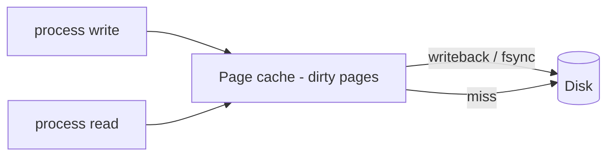

"What happens when you write to a file?" is the OS interview's sleeper question — it touches data structures (inodes), caching (the page cache), durability (fsync), and concurrency (blocking vs async I/O) in one thread.

## Inodes — files are not their names

In Unix filesystems, a file is an **inode**: a structure holding metadata (size, permissions, timestamps) and pointers to the data blocks. Names live separately — a **directory is just a table mapping names → inode numbers**. Consequences interviewers probe:

- **Hard links**: two names pointing at one inode; the file dies only when the link count hits zero *and* no process holds it open. (This is why you can delete a log file a process is writing — the space frees only when it closes the fd.)
- **Symbolic links** are files containing a path — they can dangle; hard links can't.
- Renaming within a filesystem is a directory-entry edit — O(1), atomic — which is why `write temp file, then rename` is *the* pattern for atomic file replacement.

Small files are referenced by direct block pointers in the inode; large files go through indirect blocks (pointers to pointers) — a B-tree-ish spread in modern filesystems (ext4 extents, XFS, btrfs).

## The page cache — why writes feel instant

`write()` almost never touches the disk. The kernel copies your bytes into the **page cache** and returns; dirty pages flush to disk later (periodic writeback, memory pressure). Reads likewise: recently-read blocks are served from RAM — the reason a second `grep` over the same file is 100× faster.

The price of that speed is the durability gap:

- `write()` returning ≠ data on disk. A power cut loses dirty pages.
- **`fsync(fd)`** forces the file's dirty pages (and metadata) to stable storage — this is the line databases live on. A WAL commit is: append record → `fsync` → *then* ack the client.
- `O_DIRECT` bypasses the page cache entirely — databases managing their own buffer pools use it to avoid double caching.

**Journaling** (ext4, NTFS) closes the crash-consistency hole for *metadata*: changes are appended to a journal first, so a crash mid-operation replays or discards cleanly instead of corrupting the filesystem. Data journaling is optional and costly; metadata journaling is the default compromise.

## Blocking, non-blocking, and async I/O

The default `read()` **blocks**: the thread sleeps until data arrives — fine until you need 10K concurrent connections, where thread-per-connection drowns in memory and context switches (the **C10K problem**).

- **I/O multiplexing** — `epoll`/`kqueue`: one thread asks "which of these 10K fds are ready?" and services only those. This is the engine inside Node.js, Nginx, Redis, and every async runtime.
- **Readiness vs completion**: epoll says "fd is ready, now call read" (readiness model); Windows IOCP and Linux **io_uring** say "your read finished, here's the data" (completion model — the kernel does the I/O). io_uring's shared submission/completion rings also slash syscall counts.
- `async/await` in application code is cooperative scheduling *on top of* these mechanisms — the language-level view of the same story.

Note the asterisk: on Linux, *regular file* I/O rarely blocks "usefully" under epoll (files are always "ready") — hence thread pools for disk work in Node/libuv, or io_uring, which finally makes file I/O truly async.

## Interview Q&A

**Q: A database claims a commit succeeded; the machine loses power. What guaranteed the data survives?**
A: The commit path wrote to the WAL and called `fsync` before acking — durability comes from that fsync, not from `write()`. (Plus disk write caches being flushed/battery-backed — full-stack candidates mention the hardware layer.)

**Q: Why is deleting a 100 GB file instant?**
A: Deletion unlinks the name and marks the inode/blocks free — metadata edits. No data is wiped. (And if a process still has it open, space isn't even reclaimed yet — the classic "disk full but du disagrees" incident.)

**Q: Nginx handles 10K connections with a handful of threads. How?**
A: Event loop over epoll: non-blocking sockets, one thread multiplexing readiness events, no thread-per-connection. CPU-bound or file work goes to worker pools.

**Q: What does buffered vs unbuffered I/O mean for performance?**
A: Buffered (page cache) coalesces small writes and serves re-reads from RAM — great default. Unbuffered (`O_DIRECT`) avoids double-caching and cache pollution for workloads with their own cache (databases) or streaming-once patterns.

**Q: Why is `rename()` the atomic-write trick?**
A: POSIX guarantees rename atomically replaces the target within a filesystem: readers see the old file or the new one, never a half-written mix. Write temp → fsync → rename → (fsync dir) is the crash-safe config-update recipe.
