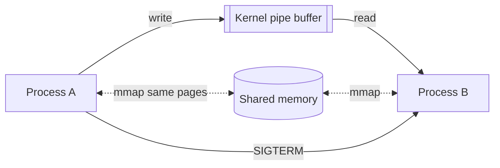

The CPU runs in **user mode** (restricted) or **kernel mode** (full hardware access). Applications can't touch disks, networks, or other processes' memory directly — they ask the kernel via **system calls** (`read`, `write`, `fork`, `mmap`, `send`…). A syscall is a controlled trap: switch to kernel mode, validate arguments, do the privileged work, return. That boundary crossing costs hundreds of nanoseconds — why batching (`writev`, buffered I/O, io_uring) matters for hot paths.

**Library call vs system call**: `printf` is a library function that buffers in userspace and eventually invokes the `write` syscall. `strlen` never enters the kernel at all.

## IPC mechanisms

Processes are isolated by design, so the kernel provides doors:

| Mechanism | Model | Notes |
| --- | --- | --- |
| **Pipe** | Unidirectional byte stream, related processes | What shells use for `a \| b` |
| **Named pipe / FIFO** | Pipe with a filesystem name | Unrelated processes |
| **Unix domain socket** | Bidirectional, socket API, local | Fast; passes file descriptors; Docker/systemd use these |
| **TCP socket** | Bidirectional, networked | Same API works cross-machine — the reason services scale out easily |
| **Shared memory** | Both map the same physical pages | Fastest (zero copies) — but now you need synchronization (semaphores) again |
| **Message queue** | Kernel-managed discrete messages | Bounded, structured |
| **Signals** | Async notification (SIGTERM, SIGKILL…) | Control, not data; handlers are minefields (async-signal-safety) |

Choosing: streams of bytes between a parent/child → pipe; local client-server → Unix socket; maximum throughput between cooperating processes (databases, browsers' renderer↔GPU) → shared memory + semaphores; "please shut down" → signal.

## Interview Q&A

**Q: What happens, step by step, during `read(fd, buf, n)`?**
A: Trap into kernel mode → kernel validates fd/buffer → if data is in the page cache, copy to the user buffer; else block the process, issue device I/O, and schedule someone else → on completion, wake the process, return bytes read, switch back to user mode.

**Q: Why is shared memory the fastest IPC?**
A: After setup, data never crosses the kernel: both processes read/write the same physical pages — zero syscalls, zero copies per message. The cost: you've reintroduced shared mutable state and must synchronize it yourself.

**Q: SIGTERM vs SIGKILL?**
A: SIGTERM is a polite, catchable request — the process can flush, clean up, then exit; orchestrators (Kubernetes, systemd) send it first. SIGKILL cannot be caught or handled; the kernel just reaps the process — no cleanup, possible corrupted state. Hence the standard TERM → grace period → KILL sequence.

**Q: Why do containers on one host use Unix sockets instead of TCP loopback sometimes?**
A: Lower overhead (no TCP/IP stack traversal), filesystem-based permissions, and fd-passing. Same socket API, so it's a config-level swap.

**Q: What makes a function unsafe to call in a signal handler?**
A: The signal may interrupt the same function mid-execution (e.g. inside `malloc` holding its lock) — re-entering deadlocks or corrupts. Only async-signal-safe functions (a short POSIX list) are legal; the robust pattern is "set a flag / write to a self-pipe, handle in the main loop."
