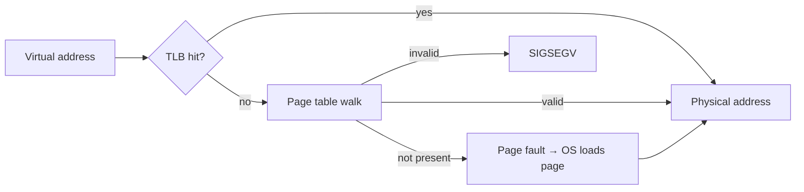

Every process sees a private **virtual address space**; the MMU translates virtual → physical addresses via **page tables** maintained by the OS. This indirection buys isolation (no process can address another's memory), the illusion of large contiguous memory, and tricks like copy-on-write and memory-mapped files.

## Paging mechanics

Memory is split into fixed **pages** (typically 4 KB). A virtual address = page number + offset; the page table maps page → physical frame. Multi-level page tables keep the map sparse (you don't materialize entries for unused address space).

**TLB** (translation lookaside buffer): a tiny cache of recent translations inside the CPU. TLB hits make translation free; misses walk the page table (expensive). This is why context switches between processes cost more than thread switches — the TLB must be flushed or re-tagged.

**Page fault**: accessing a page with no valid mapping traps to the OS. Three flavors:
- **Minor** — page is in memory but not mapped (first touch of allocated memory, shared lib already loaded). Cheap.
- **Major** — page must be fetched from disk (swapped out, or a memory-mapped file). Milliseconds — 5–6 orders of magnitude slower than RAM.
- **Invalid** — no such mapping: segfault.

**Demand paging** loads pages only on first touch — `malloc(1GB)` is instant; the cost is paid page-by-page as you write. **Copy-on-write** shares pages between processes (after `fork`) until someone writes.

## When memory runs out

The OS evicts pages to swap using a replacement policy — approximations of **LRU** (true LRU is too costly; clock/second-chance algorithms use per-page reference bits). Under real pressure the system **thrashes**: the working set exceeds RAM, every eviction faults right back in, and throughput collapses while disk churns. Linux, at the end of the line, invokes the **OOM killer** to sacrifice a process.

## Interview Q&A

**Q: Why virtual memory at all — why not hand out physical addresses?**
A: Isolation (a bug in one process can't scribble on another), no fragmentation-driven relocation problems, overcommit/demand paging, and sharing (libraries, COW) — all from one level of indirection.

**Q: Stack vs heap?**
A: Stack: per-thread, automatic, LIFO frames, fast (pointer bump), size-limited (overflow = crash). Heap: process-wide, managed by allocator/GC, for dynamic lifetimes. Both live in the same virtual address space, growing toward each other historically.

**Q: What makes a major page fault so expensive?**
A: Disk. RAM is ~100ns; an SSD read is ~100µs, spinning disk ~ms — a 10³–10⁵× penalty, plus the trap, scheduling, and I/O path overhead.

**Q: What is thrashing and how do you detect/fix it?**
A: Working set > RAM → continuous fault-evict-fault loops; CPU looks idle while disk I/O is saturated and page-fault rates spike. Fix: add RAM, shrink working sets, or reduce multiprogramming degree (run fewer things).

**Q: Why are 4 KB pages the norm, and when do huge pages help?**
A: Small pages minimize internal fragmentation and give fine-grained protection; but each page needs a TLB entry, so huge working sets (databases, JVMs) blow the TLB. 2 MB/1 GB huge pages cut TLB misses dramatically for such workloads.
