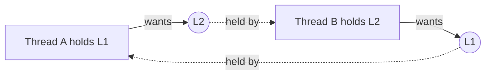

A **race condition** is when correctness depends on the timing of thread interleaving. The canonical bug: two threads run `count++` (read-modify-write, three instructions); interleaved, both read 5, both write 6 — one increment lost. The code section touching shared state is the **critical section**; synchronization ensures **mutual exclusion** over it.

## The toolbox

- **Mutex** — one owner at a time; others block. The default for protecting shared data. Comes with rules: same thread must unlock, keep critical sections tiny, no I/O while holding.
- **Semaphore** — a counter: `wait()` decrements (blocking at 0), `signal()` increments. A binary semaphore ≈ mutex without ownership; a counting semaphore gates N-at-a-time access (connection pools, bounded buffers).
- **Condition variable** — "sleep until a predicate might be true": `wait(cv, lock)` atomically releases the lock and sleeps; `signal/broadcast` wakes waiters, who **re-check the predicate in a while-loop** (spurious wakeups are real). The producer-consumer pattern is mutex + two CVs (not-full, not-empty).
- **Spinlock** — busy-wait instead of sleeping. Wins only when the wait is shorter than a context switch (kernel internals, very short sections on multicore).
- **Atomics / CAS** — hardware compare-and-swap enables lock-free counters, flags, and queues. `count.fetch_add(1)` fixes the canonical race with no lock at all.
- **Read-write lock** — many readers or one writer; pays off when reads dominate heavily.

## Deadlock in one screen

Four conditions must all hold: mutual exclusion, hold-and-wait, no preemption, **circular wait**. The classic: thread A holds lock 1 wants lock 2; thread B holds 2 wants 1.

Practical prevention = break circular wait: **acquire locks in a global fixed order**, everywhere. Alternatives: `tryLock` with timeout + backoff, or lock both atomically. Detection (cycle in the waits-for graph) + recovery is the database approach — kill one victim transaction and let it retry.

## Interview Q&A

**Q: Mutex vs semaphore — the real difference?**
A: Ownership and intent. A mutex is a *lock* (holder must release; protects a critical section). A semaphore is a *signal/counter* (any thread may signal; coordinates events or limits concurrency). Using a binary semaphore as a mutex loses ownership guarantees like priority inheritance.

**Q: Why must condition-variable waits be wrapped in `while (!predicate)`?**
A: Spurious wakeups, and the predicate may have been re-falsified between signal and wake (another consumer took the item). The while-loop re-check makes the code correct regardless.

**Q: Your service deadlocks in production. Diagnose and fix?**
A: Grab thread dumps — deadlocked threads show as blocked on each other's locks (JVM/`pprof` will name the cycle). Fix long-term: global lock ordering; tactically: timeouts on acquisition. Mention that DBs solve the same problem with detection + victim abort.

**Q: What's priority inversion and its fix?**
A: High-priority task blocks on a lock held by a low-priority task that keeps getting preempted by medium tasks — high effectively runs at low priority. Fix: priority inheritance (holder inherits waiter's priority until it releases).

**Q: When are atomics better than a mutex?**
A: Single-variable state (counters, flags, publish-once pointers): no blocking, no deadlock, cheaper. Once invariants span multiple variables, hand-rolled lock-free logic becomes subtle-bug territory — use a lock.
