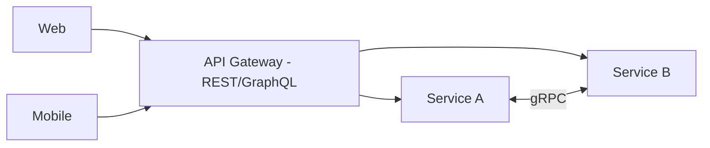

Every system design interview contains a mini API-design interview ("what does the API look like?"). Strong answers model resources cleanly, get the boring details right — pagination, versioning, idempotency, errors — and pick the protocol by consumer, not fashion.

## REST resource modeling

Resources are nouns; HTTP methods are the verbs:

```
GET    /users/{id}/orders?status=open&limit=20&cursor=abc   # list, filtered
POST   /orders                                              # create
GET    /orders/{id}                                         # read
PATCH  /orders/{id}                                         # partial update
DELETE /orders/{id}                                         # delete
```

- Avoid verbs in paths (`/getOrders` ❌). For genuine *actions* that don't map to CRUD, a sub-resource POST is accepted practice: `POST /orders/{id}/cancel`.
- Nest one level max; deeper nesting (`/users/1/orders/2/items/3/…`) couples clients to hierarchy — items are addressable as `/order-items/{id}`.
- Status codes are the contract: 201 + Location on create, 400 malformed vs 422 invalid, 401 unauthenticated vs 403 unauthorized, 409 conflict, 429 rate-limited. Errors return a structured body (code, message, correlation ID) — not just a status.

## The details that separate seniors

### Pagination

**Offset** (`?page=12`) is simple but degrades (DB still scans skipped rows) and *skips/duplicates items* when rows are inserted mid-pagination. **Cursor-based** (`?cursor=<opaque token encoding last-seen key>`) is stable and indexed — the default for anything user-facing or large. Return the next cursor with each page; make the token opaque so you can change its internals.

### Idempotency

Networks retry; your API must tolerate it. GET/PUT/DELETE are idempotent by design. For POST (create payment!), accept an `Idempotency-Key` header — the server stores key → response and replays the stored response on retry. This one paragraph is mandatory in any payments-adjacent design.

### Versioning

You *will* need breaking changes. Options: URL (`/v2/orders` — visible, cache-friendly, most common), header (`Accept: application/vnd.api+json;version=2` — purist, less discoverable). Pick one, and state the real rule: **additive changes shouldn't require a version bump** — clients must ignore unknown fields.

### Rate limiting headers

Return `429` with `Retry-After`, plus `X-RateLimit-Remaining`-style headers so well-behaved clients back off before hitting the wall.

## REST vs gRPC vs GraphQL

| | REST | gRPC | GraphQL |
| --- | --- | --- | --- |
| Contract | OpenAPI (optional) | Protobuf (enforced) | Schema (enforced) |
| Transport | JSON/HTTP | Binary/HTTP2, streaming | JSON/HTTP, single endpoint |
| Sweet spot | Public APIs, CRUD | Service-to-service, low latency | Many client shapes (mobile+web) over many resources |
| Pain | Over/under-fetching | Browser support needs a proxy | Server complexity: N+1s, caching, query cost limits |

The pattern interviewers like: **gRPC inside** (typed contracts, streaming, cheap serialization between microservices), **REST or GraphQL at the edge** (browser-native, cacheable, human-debuggable). GraphQL earns its complexity when *diverse clients* need different slices of the same graph — not as a default.



## Interview Q&A

**Q: Design the API for a feed. What matters?**
A: Cursor pagination (feeds mutate constantly — offsets break), a `limit` cap, and cache headers. `GET /feed?cursor=…&limit=20` returning items + `next_cursor`.

**Q: How do you make `POST /payments` safe to retry?**
A: Idempotency-Key header; server persists key → result atomically with the payment; retries replay the stored result. Keys expire after ~24h.

**Q: PUT vs PATCH?**
A: PUT replaces the whole resource and is idempotent; PATCH applies a partial change and may not be. In practice most "update" endpoints are PATCH with validation.

**Q: When is GraphQL the wrong choice?**
A: Server-to-server APIs (use gRPC), simple CRUD with one client shape (REST is cheaper), or teams unwilling to invest in query cost limits, persisted queries, and caching — GraphQL without those is an outage generator.

**Q: How do you paginate a resource sorted by a non-unique column?**
A: Cursor over a compound key — `(created_at, id)` — so ties break deterministically; the cursor encodes both.
