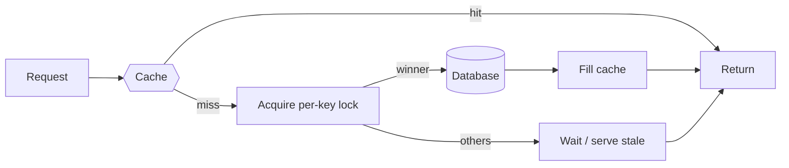

Caching trades memory (and staleness) for latency and load reduction. It appears at every layer — browser, CDN, LB, application (Redis/Memcached), and inside the database — and "where do you cache and how does it invalidate?" is a guaranteed interview follow-up.

## Write policies

- **Cache-aside (lazy)** — the default. App reads cache → on miss, reads DB and fills cache; writes go to the DB and **invalidate** (delete, don't update) the cache entry. Simple, tolerant of cache loss; first read after a write is a miss.
- **Write-through** — writes go through the cache to the DB synchronously. Reads are always warm; writes pay double latency.
- **Write-behind (write-back)** — write to cache, flush to DB asynchronously. Fastest writes, but you can **lose acknowledged data** if the cache dies before flushing — only for tolerable data (view counters), never for money.

Delete-not-update on invalidation avoids a subtle race where two concurrent writes leave the cache holding the older value forever.

## Eviction & TTL

Memory is finite: **LRU** is the default eviction; **LFU** resists one-off scans flushing hot data. Every entry should have a **TTL** as a staleness backstop even with explicit invalidation — invalidation bugs are inevitable, and TTL turns "wrong forever" into "wrong for five minutes."

## The three classic failure modes

1. **Cache avalanche** — a mass of keys expires at once (or the cache restarts cold) and the DB gets the full read load instantly. Fix: jitter TTLs (`ttl + random()`), warm caches before traffic, rate-limit DB refill.
2. **Cache stampede (thundering herd)** — one *hot* key expires and 10,000 concurrent requests all miss and hammer the DB for the same row. Fix: per-key mutex so one request refills while others wait, or serve stale while revalidating in the background.
3. **Cache penetration** — requests for keys that don't exist anywhere (often malicious) always miss and always hit the DB. Fix: cache negative results with a short TTL, or screen with a Bloom filter.

## Interview framing

Name the pattern (cache-aside with delete-on-write invalidation + TTL backstop), then volunteer a failure mode and its fix. Bonus points for the phrase "cache invalidation is one of the two hard problems" *followed by an actual strategy* rather than the joke alone.
