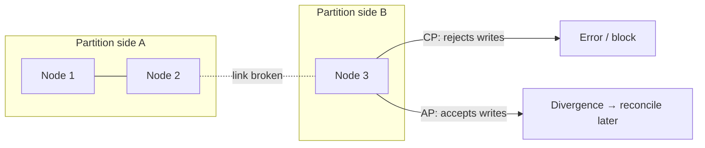

CAP says: when a **network partition** happens (and it will), a distributed system must choose between **consistency** (every read sees the latest write) and **availability** (every request gets a non-error response). That's it — it's a statement about behavior *during partitions*, not a menu of three from which you pick two.

Common misreadings to avoid in interviews:

- "Pick 2 of 3" — wrong; partition tolerance isn't optional in any real network. The choice is only C-vs-A, and only during a partition.
- CAP-consistency is **linearizability** — not ACID's C (integrity constraints).
- During normal operation there's no forced trade-off; the interesting related trade-off there is latency-vs-consistency (PACELC: *if Partition, A or C; Else, Latency or Consistency*).

## CP vs AP in practice

| | CP — refuse rather than lie | AP — answer, possibly stale |
| --- | --- | --- |
| During partition | Minority side rejects/blocks | All sides keep serving |
| Examples | ZooKeeper/etcd, Spanner, single-primary DBs that fail writes without quorum | Cassandra, DynamoDB, DNS |
| Choose for | Money movement, leader election, inventory locks, uniqueness | Feeds, carts, likes, presence, watch history |

AP systems must eventually **reconcile** divergent writes: last-writer-wins (simple, silently drops data), vector clocks + application merge, or CRDTs (data types that merge deterministically).

## The consistency spectrum

Real systems tune per operation, not per database:

- **Linearizable/strong** — reads see the latest write, globally.
- **Read-your-writes / session** — *you* see your own updates; others may lag. What most products actually need (your own profile edit must show; others seeing it 2s later is fine).
- **Causal** — effects never appear before their causes (a reply never precedes its parent).
- **Eventual** — replicas converge, no timing promise.

Quorum systems (Dynamo-style `R + W > N`) let you dial this per request.

## Interview framing

Never label a whole design "AP" or "CP." Split by operation: "payments are CP through the SQL primary; the activity feed is AP through Cassandra with read-your-writes for the author." Per-operation consistency choices are the strongest distributed-systems signal you can send in an interview.
