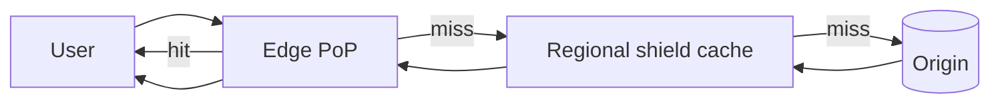

A CDN is a globally distributed cache: users hit a nearby **edge server** (routed by anycast or geo-DNS) instead of your origin. It cuts latency (physics — fewer round-trip miles), slashes origin load and egress cost, and absorbs traffic spikes and much of the DDoS baseline.

## Pull vs push

- **Pull (default)** — edge fetches from origin on first miss, caches per `Cache-Control` headers. Zero ops effort; first user per region eats the slow request. Right answer for almost everything.
- **Push** — you pre-load content to edges before demand. Only worth it when demand is *predictable* and payloads are huge — video libraries (Netflix pre-pushes overnight — see the Netflix case study), game launches, software releases.

## What to cache

| Content | CDN? | Notes |
| --- | --- | --- |
| Static assets (JS/CSS/images/fonts) | Always | Hashed filenames → cache forever (`immutable`) |
| Video segments | Always | This is what CDNs are built for |
| Public API responses | Often | Short TTL (seconds) still absorbs thundering herds |
| Personalized/authenticated pages | Rarely | Cache fragments or use edge compute carefully |

## Invalidation — the real interview question

1. **Versioned URLs (best)** — content-hashed filenames (`app.4f2a1c.js`); a deploy references new names, old ones stay valid. Invalidation becomes *unnecessary*.
2. **TTL** — accept bounded staleness; short TTLs for HTML, long for assets.
3. **Purge API** — explicit eviction; propagation takes seconds-to-minutes and shouldn't be a critical-path dependency.

The `stale-while-revalidate` directive is the pro move: serve the cached copy instantly while refreshing in the background — users never wait on origin.

A **shield/mid-tier cache** collapses misses from hundreds of edges into one origin fetch — protecting origin during global cache-cold moments.

## Interview framing

Any design with static assets, media, or geographically spread users should have a CDN drawn in from the start — then say *how it stays correct*: hashed asset URLs, TTLs on semi-dynamic content, and purge as the escape hatch. Invalidation strategy is what they're actually probing for.
