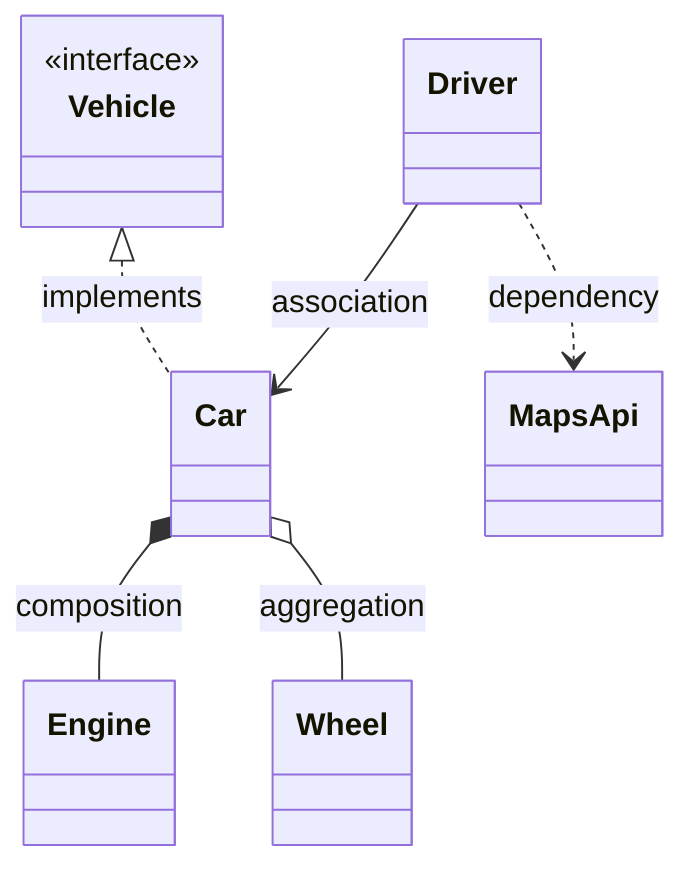

Nobody ships UML anymore, but LLD interviews still happen on whiteboards — and the relationship arrows are a shared vocabulary. You need the useful subset, drawn fast and read fluently.

## Class boxes

Three compartments: name, attributes, methods. Visibility: `+` public, `-` private, `#` protected. `<<interface>>` or *italics* for abstract. Don't list every getter — show what carries design intent.

## The five relationships that matter



| Relationship | Arrow | Meaning | Litmus test |
| --- | --- | --- | --- |
| **Composition** | filled diamond ◆ | Part dies with the whole | Order *composes* OrderLines — delete order, lines go |
| **Aggregation** | hollow diamond ◇ | Has-a, independent lifetime | Team has Players; players outlive the team |
| **Association** | plain arrow → | Knows / holds a reference | Driver has a `car` field |
| **Dependency** | dashed arrow ⇢ | Uses transiently (param, local) | Method takes `MapsApi` as an argument |
| **Inheritance / realization** | hollow triangle ▷ (dashed for interfaces) | Is-a / implements | `Car` implements `Vehicle` |

In practice the composition-vs-aggregation distinction is the one interviewers probe ("what happens to line items when the order is deleted?") — the rest is arrow literacy.

## Multiplicity

Numbers at line ends: `1`, `0..1`, `*`, `1..*`. `Order "1" --> "1..*" OrderLine` reads "one order has one or more lines." Write them only where cardinality is a real design fact (can an account have multiple owners?) — that's exactly where bugs live.

## Whiteboard pragmatics

- Boxes + correct arrows + multiplicity where it matters; skip attribute types unless asked.
- Draw interfaces for the parts you claim are extensible — an `<<interface>> FeeStrategy` box makes your OCP argument visible.
- Sequence diagrams: keep one in your pocket for "walk me through the flow" — vertical lifelines, horizontal calls in time order. For request flows it often communicates better than the class diagram.
- Mermaid renders both (` ```mermaid classDiagram` / `sequenceDiagram`) — handy for take-home design docs like the ones on this site.

Treat UML as compressed communication, not ceremony: if the interviewer can reconstruct your object model from the sketch alone, it did its job.
