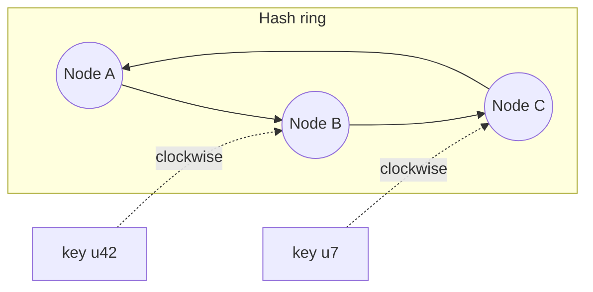

How do you spread keys across N cache/database nodes so that adding or removing a node doesn't reshuffle everything? `hash(key) mod N` fails exactly there: change N and **almost every key remaps** — a cluster-wide cache flush and origin stampede on every scale event.

## The hash ring

Hash both **nodes and keys** onto the same circular space (0 … 2⁶⁴). A key belongs to the first node clockwise from it.

- **Remove a node** → only *its* keys slide to the next node clockwise; everything else stays put.
- **Add a node** → it takes a slice from one neighbor only.

On average, changing one node out of N moves just **1/N of the keys** — versus nearly all of them under mod-N.

## Virtual nodes

Plain rings have two problems: random node positions make uneven slices, and a leaving node dumps its whole range on a single neighbor. Fix: each physical node appears at **many ring positions** (100–1000 "vnodes"). Load evens out statistically, a failed node's range scatters across the whole cluster, and heterogeneous hardware gets proportional vnode counts. Cassandra, DynamoDB, and Riak all do this.

## Where you'll use it

- **Distributed caches** — memcached/Redis client-side sharding; the original motivation (minimal cache-miss storm on scale events).
- **Dynamo-style databases** — partition ownership + replication (each key stored on the next R nodes clockwise).
- **Load balancing with affinity** — same client/session/entity → same backend, surviving pool changes.
- **Rendezvous hashing** — the cousin: pick `argmax hash(key, node)`; simpler, no ring state, great for small N.

## Interview framing

The trigger phrase is "we shard/cache by key and nodes come and go." Give the two-liner — "consistent hashing on a ring with virtual nodes, so scaling moves only 1/N of keys and failure load spreads evenly" — and connect it to the concrete pain it prevents: a cache-flush stampede on every autoscale event.
