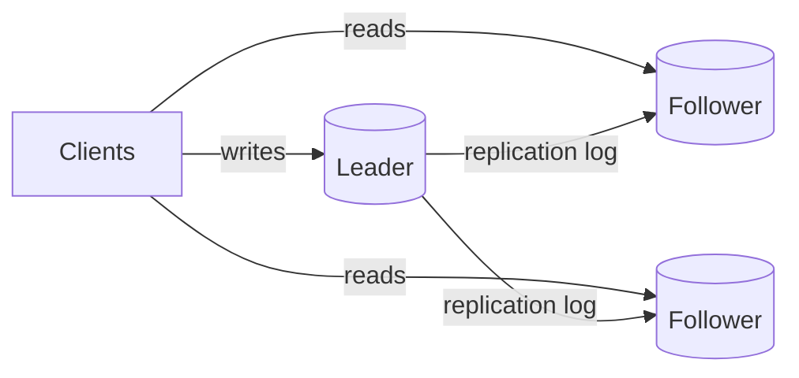

Replication keeps copies of the same data on multiple nodes. You do it for three reasons — read scaling, availability (survive a node loss), and latency (data near users) — and the whole topic is about what those copies cost you in consistency.

## Leader-follower (the default)

One node (leader/primary) accepts all writes and streams its change log to followers, which apply it in order and serve reads.

### Sync vs async — the central trade-off

- **Asynchronous**: leader acks the write immediately, streams to followers in the background. Fast, but leader failure can **lose acked writes** that never reached a follower.
- **Synchronous**: leader waits for follower ack. No loss, but every write pays a network round trip, and a slow/dead follower stalls all writes.
- **Semi-synchronous** (the practical answer): wait for *one* follower (or a quorum), async to the rest. One durable copy guaranteed without hostage-taking by the slowest node.

## Replication lag and its anomalies

Async followers run seconds (or worse) behind. Interviewers love the three named anomalies:

- **Read-your-own-writes**: user posts a comment, refreshes, it's gone (read hit a lagging follower). Fix: route a user's reads to the leader briefly after they write, or pin by session.
- **Monotonic reads**: consecutive reads hit differently-lagged followers and time appears to go backwards. Fix: pin each session to one replica.
- **Consistent prefix**: an observer sees an answer before the question. Fix: causally related reads from the same partition/replica.

Saying "route critical reads to the leader; bulk/analytics reads to followers" resolves most designs.

## Failover — where the bodies are buried

Leader dies. A follower is promoted. The hard parts:

- **Detection**: distinguishing "dead" from "slow" is impossible in general — timeouts are a guess. Too aggressive → split brain; too lazy → minutes of write downtime.
- **Split brain**: the old leader comes back and still thinks it leads; two nodes accept writes and diverge. Prevention: quorum-based election plus **fencing** (epoch numbers — storage/clients reject writes from a stale-epoch leader).
- **Lost writes**: with async replication, the most-caught-up follower may still miss the old leader's final writes. They're gone. This is the concrete price of async — say it explicitly.

Consensus systems (Raft/Paxos — etcd, ZooKeeper, or built-in as in modern distributed SQL) exist to make election + log agreement safe.

## Other topologies

- **Multi-leader**: writes accepted in multiple regions, replicated both ways. Lower write latency per region, but concurrent writes to the same key **conflict** and need resolution (LWW loses data silently; better: per-key merge rules or CRDTs). Use only when geo-local writes are a hard requirement.
- **Leaderless** (Dynamo-style: Cassandra): any replica accepts writes; reads/writes use quorums (R + W > N), with read repair and hinted handoff patching stragglers. Tunable consistency per query, no failover dance — but no transactions and sloppy edges under partition.

## Interview Q&A

**Q: Read replicas aren't keeping up with traffic growth. Options?**
A: Add replicas (fan-out has limits — leader must stream to each), add a caching tier in front, or split read models (search index, analytics warehouse) fed from the replication log via CDC. If *writes* are the bottleneck, replication can't help — that's sharding's job.

**Q: How would you serve users in three continents?**
A: Reads: followers in each region. Writes: either accept cross-continent write latency to one leader, or go multi-leader/per-region-homed data (partition users by home region — each region is the leader *for its own users*), avoiding write conflicts by construction.

**Q: What's CDC and why is it everywhere?**
A: Change Data Capture — consuming the database's replication log as an event stream (e.g., Debezium → Kafka). It's the reliable way to sync caches, search indexes, and warehouses without dual-writes, which drift.

**Q: RPO/RTO in one line each?**
A: RPO — how much data you may lose (async lag at crash). RTO — how long until you're serving again (failover time). Sync replication buys RPO≈0; automated failover buys low RTO; both cost something.
