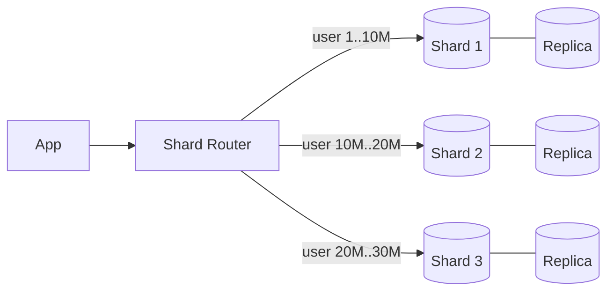

Sharding splits one logical dataset across multiple database nodes, each owning a subset of rows. It's the answer when a single primary can no longer absorb the write load or hold the data — and it's a one-way door that costs you joins, transactions, and simplicity. Exhaust replicas and caching first.

## Partitioning strategies

- **Hash-based** — `shard = hash(key) mod N` (or better, consistent hashing / hash ranges). Spreads load evenly; kills range queries (adjacent keys land on different shards).
- **Range-based** — key ranges per shard (users A–F → shard 1). Great for range scans; invites **hot spots** (all new, time-ordered keys hit the last shard).
- **Directory-based** — a lookup service maps key → shard explicitly. Maximum flexibility (move tenants individually), plus a new critical component to keep consistent and available.

## Choosing the shard key

The single most important decision. A good key:

1. **Matches the dominant query pattern** — if every query is "by user", shard by `user_id` so queries hit one shard.
2. **Distributes load evenly** — monotonically increasing keys (auto-increment, timestamps) funnel all inserts to one shard; celebrity tenants create hot shards regardless of scheme.
3. **Rarely needs cross-shard operations** — anything touching many shards (scatter-gather) loses most of sharding's benefit.

Each shard still gets its own replicas — sharding solves capacity, replication solves availability; you need both.

## What sharding breaks

- **Cross-shard joins** — gone. Denormalize, duplicate reference data onto every shard, or join in the application.
- **Cross-shard transactions** — need 2PC or sagas; both are painful. Design so entities that transact together share a shard (e.g. shard by `tenant_id`).
- **Unique constraints & IDs** — global auto-increment dies; use UUIDs or Snowflake-style IDs.
- **Rebalancing** — adding shards means moving data live. Consistent hashing or pre-splitting into many virtual shards (e.g. 1024 vnodes mapped onto N physical nodes) makes this survivable — see [consistent hashing].

## Interview framing

State the escalation honestly: "replicas for reads, cache in front, shard only when writes/data outgrow one primary — then shard by `user_id` because every query in this design is per-user." Then name one thing you lose (cross-user transactions) and how you cope. That sequencing shows judgment, not just vocabulary.
