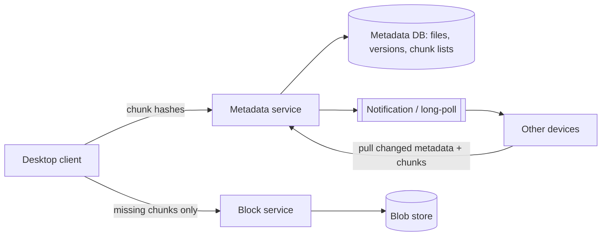

## 1. Requirements

**Functional**

- Upload/download files from any device; edits sync automatically across devices.
- Share files/folders with other users; view version history.
- Work offline, reconcile when back online.

**Non-functional**

- Files up to GBs; total storage exabyte-class — but per-user metadata is small.
- Sync should feel instant for small edits; bandwidth-efficient for large files.
- Durability is sacred: **99.999999999%** — losing a user's file is existential.
- Consistency: a device must never end up with a silently corrupted merge.

## 2. The core insight: files are chunks

Treat every file as a sequence of **chunks** (~4 MB), each identified by the hash of its content (content-addressed storage). Everything good follows:

- **Delta sync** — edit 10 bytes of a 2 GB file, and only the affected chunk(s) re-upload.
- **Dedup** — the same chunk uploaded by anyone, in any file, is stored once. (A popular PDF shared by 10K users costs one copy.)
- **Integrity** — a chunk's name *is* its checksum; corruption is self-evident.
- **Resumable transfers** — an interrupted upload resumes at the next missing chunk.

A file is then just metadata: an ordered list of chunk hashes plus name, size, and version.

## 3. High-level architecture

**Upload**: client chunks the file, hashes each chunk, asks the metadata service "which of these do you already have?", uploads only the missing chunks to the block store, then commits the new file version (list of hashes) atomically.

**Sync down**: other devices learn of the change via long-poll/WebSocket notification, fetch the new chunk list, diff against local chunks, and download only what's new.

## 4. Deep dives

### Metadata vs blocks — two different databases

Blocks are immutable blobs → object store (S3-class), cheap and infinitely scalable. Metadata (file tree, versions, sharing ACLs) is small, hot, relational, and needs transactions → sharded SQL. Splitting these is *the* architectural move; committing a version is a metadata transaction that only happens after all blocks are durably stored.

### Conflict resolution

Two devices edit the same file offline. On reconnect, the first commit wins; the second client's commit fails its precondition (base version moved). **Never auto-merge binary files** — create a conflict copy ("Ashish's conflicted copy 2026-07-15") and let the human decide. Interviewers respect this answer because it's what real products do.

### Version history

Versions are just older chunk lists — and thanks to dedup, ten versions of a 2 GB file that differ by one chunk cost 2 GB + 9 chunks, not 20 GB. Garbage-collect chunks only when no version in any retention window references them (reference counting over chunk hashes).

### Sync protocol efficiency

- Fixed-size chunking breaks dedup on insertion (every subsequent chunk shifts). **Content-defined chunking** (Rabin fingerprinting) cuts chunk boundaries by content, so an insert only changes nearby chunks.
- Compress chunks before upload; encrypt at rest and in transit.
- Batch tiny files — thousands of 2 KB files shouldn't mean thousands of round trips.

### Client is half the system

The desktop client maintains a local DB (SQLite) of file → chunk state, watches the filesystem for events, and reconciles three trees: local disk, local DB, and remote truth. Mentioning the client's reconciliation loop signals you've thought past the boxes-and-arrows.

## 5. Trade-offs recap

| Decision | Chose | Cost |
| --- | --- | --- |
| Storage model | Content-addressed 4 MB chunks | Metadata complexity |
| Chunking | Content-defined (Rabin) | CPU on client |
| Conflicts | First-writer-wins + conflict copies | Users occasionally merge by hand |
| Metadata | Sharded SQL, transactional commit | Shard-key design work (by user/namespace) |

Dropbox is the canonical **metadata/blob split + dedup** case study. Lead with "files are chunk lists," and the rest of the interview falls out naturally.
