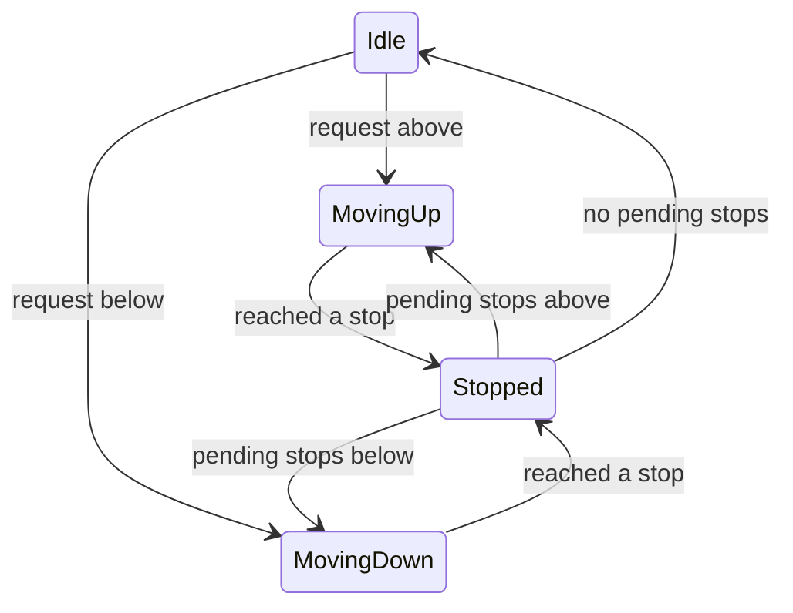
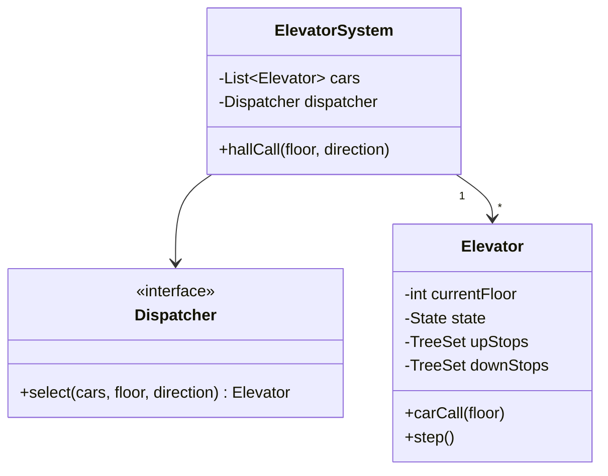

The elevator problem looks like a class-design exercise but is secretly an **algorithms-and-state-machine** exercise. Candidates who model ten classes and no scheduling logic fail it; the core is: which car answers a call, and in what order does a car serve its stops?

## 1. Scope

- N elevators, M floors; hall calls (up/down button on a floor) and car calls (floor button inside).
- Optimize: reasonable wait times, no starvation.
- Out of scope unless asked: weight limits, express zones, fire mode (mention they'd be states/policies).

## 2. The elevator as a state machine



Model it explicitly — `enum State { IDLE, MOVING_UP, MOVING_DOWN, STOPPED }` plus transitions in one place — rather than scattered booleans (`isMoving`, `goingUp`). Doors are a nested concern (`OPEN/CLOSING/CLOSED`) that gates movement: the state machine *is* the correctness argument.

## 3. The scheduling insight: SCAN (the "elevator algorithm")

FCFS is provably terrible: serving requests in arrival order (3↑, 9↑, 2↑) zigzags the car. Real elevators run **SCAN**: keep moving in the current direction, servicing every stop in that direction; reverse only when nothing remains ahead.

The elegant implementation — the thing to actually write on the whiteboard:

```text
class Elevator:
    upStops:   TreeSet<int>   # sorted floors to visit going up
    downStops: TreeSet<int>   # sorted descending

    step():
        if MOVING_UP:  next = upStops.ceiling(current)   # nearest stop above
        if MOVING_DOWN:next = downStops.floor(current)
        reverse or go IDLE when the active set empties
```

Two sorted sets replace any queue-juggling. A hall call "down from floor 7" goes into `downStops`; a car call inside joins the set matching its direction relative to the car. Starvation is structurally impossible — every stop is reached within one full sweep.

## 4. Dispatching across N cars

Which elevator gets a new hall call? A `Dispatcher` (Strategy interface — this is where the pattern genuinely earns its place):

- **Nearest car** — minimal distance, ignores direction; okay baseline.
- **Directional cost** (the expected answer): a car moving *toward* the call in the *same direction* costs its distance; a car moving away costs its remaining sweep + return. Assign the min-cost car.
- Mention real buildings use *destination dispatch* (you type your floor in the lobby; the system groups passengers by destination) as the modern extension.

Dispatcher owns assignment; each elevator owns its own stop sets and state machine. That separation of concerns is the design's backbone.

## 5. Class sketch



Concurrency note worth saying: calls arrive from many threads (buttons), but each elevator's stop sets should be mutated through a single-threaded command queue per car — turning a locking problem into message passing.

## 6. What interviewers grade

| Signal | How you show it |
| --- | --- |
| Algorithmic core | SCAN with two sorted sets, said early |
| State modeling | Explicit state machine, doors gating movement |
| Multi-car judgment | Directional-cost dispatch; Strategy for swappability |
| No starvation | One-sweep argument |
| Extension fluency | Fire mode = state override; VIP floor = dispatcher policy; capacity = skip hall calls when full |

Lead with SCAN in the first five minutes. Class diagrams decorate the answer; the scheduling *is* the answer.
