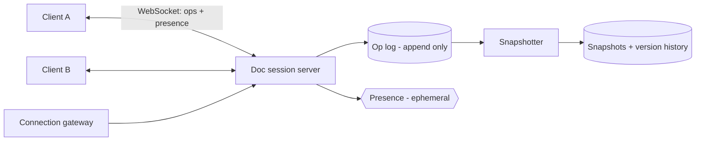

## 1. Requirements

**Functional**

- Multiple users edit one document simultaneously; everyone converges to the same text.
- Live cursors/presence, comments, and version history.
- Offline edits merge on reconnect.

**Non-functional**

- Edit propagation under ~200 ms to feel "live".
- **Convergence is correctness**: all replicas must reach identical state regardless of message ordering.
- A document has few collaborators (2–50), but the service hosts millions of documents.

## 2. Why naive approaches destroy documents

Send the whole document on every keystroke? Bandwidth-insane and last-write-wins: two concurrent edits and one user's work vanishes.

Send operations like `insert("x", position 5)`? Better — but positions shift. If Alice inserts at 5 while Bob deletes at 2, applying Alice's op unadjusted on Bob's replica inserts at the wrong place. Concurrent ops must be *reconciled*, and there are two schools:

### Operational Transformation (OT) — what Google Docs uses

Every op is transformed against concurrent ops before applying: Alice's `insert@5` becomes `insert@4` on replicas that already applied Bob's `delete@2`. In practice OT uses a **central server** as the single sequencer — each client sends ops with the last server revision it saw; the server transforms, assigns the next revision, and broadcasts. Central ordering makes OT tractable (peer-to-peer OT is notoriously hard to get right).

### CRDTs — what Figma-era systems use

Conflict-free Replicated Data Types give every character a globally unique, ordered ID; concurrent inserts commute by construction, so replicas converge **without a central sequencer**. Great for offline-first and P2P. Costs: metadata overhead per character (mature libraries like Yjs compress this well) and trickier semantics for rich structures.

**Interview take**: with a server in the picture anyway (auth, persistence), OT-with-central-sequencer is the classical answer; CRDTs are the modern one. Name both, pick one, justify.

## 3. High-level architecture

All collaborators of a document connect (via a gateway) to **the same session server** — the sequencer for that doc. It orders ops, transforms, broadcasts, and appends to the op log. Document state = latest snapshot + ops since; a snapshotter compacts periodically so loading a doc doesn't replay a year of keystrokes.

## 4. Deep dives

### Client pipeline

Each client keeps: confirmed state (server revision), in-flight op, and a buffer of pending local edits. Local edits apply **optimistically** (typing must never wait on the network), then reconcile as server acks arrive. This client-side OT is half the algorithm — mention it.

### Doc-affinity routing

Sharding key is document ID: the gateway consistently routes every collaborator of doc X to the session server owning X. If that server dies, another loads snapshot+log and clients reconnect/replay — the op log makes session servers effectively stateless.

### Presence and cursors

Cursors, selections, and "Bob is here" are ephemeral — no log, no history. Broadcast on a separate lightweight channel, rate-limited (cursor moves at 60/sec matter to nobody). Separating durable ops from ephemeral presence keeps the op log lean.

### Version history

Free by construction: the op log *is* history. Named versions are pointers into it; "who wrote this" is attribution metadata on ops. Storage is bounded by snapshot + compaction policy (e.g., collapse fine-grained ops older than 30 days).

### Offline edits

A returning client submits a batch of ops against an old revision; the server transforms them across everything since. Long divergence makes transforms expensive and semantically mushy — cap offline windows or fall back to a "review conflicts" flow for extreme cases (or use CRDTs, whose merge is order-free by design).

## 5. Trade-offs recap

| Decision | Chose | Cost |
| --- | --- | --- |
| Convergence | OT with central sequencer | Server is per-doc serialization point |
| Transport | WebSocket with doc affinity | Sticky routing + reconnect logic |
| Persistence | Op log + periodic snapshots | Compaction machinery |
| Presence | Ephemeral side channel | None — that's the point |

Collaborative editing is a **consistency algorithm wearing a product**: show you know why positions shift, what OT/CRDTs each buy, and that typing latency is sacred — the boxes are the easy part.
