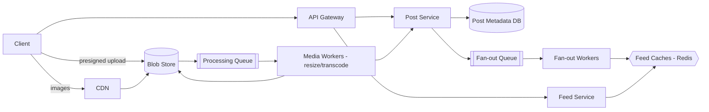

## 1. Requirements

**Functional**

- Upload photos/short videos with captions; follow users.
- Home feed of recent posts from followed accounts (assume chronological; note that ranking is a layer on top).
- Like/comment; user profile grid.

**Non-functional**

- Feed and image loads must feel instant — media latency *is* the UX.
- Read-heavy (~100:1) like Twitter, **plus** multi-megabyte media objects.
- Durable media (photos are memories — losing them is catastrophic); eventual consistency for feeds/counters is fine.

## 2. Capacity estimation

Assume 500M DAU, 100M uploads/day, average post ~2 MB after processing.

| Metric | Estimate |
| --- | --- |
| Upload writes | 100M/day ≈ 1,200/sec |
| Media ingest | 1,200 × 2 MB ≈ **2.4 GB/sec** |
| Media storage | 200 TB/day → ~70 PB/year — blob store + lifecycle tiering |
| Feed reads | 500M × 10 loads/day ≈ **60K/sec** |
| Metadata | Post rows are ~KB — tiny next to media |

Two distinct problems: a **metadata/feed system** (Twitter-shaped) and a **media pipeline** (Netflix-lite). Keep them decoupled.

<!--more-->

## 3. The core question: serving media fast

**Never store images in the database.** Media goes to a blob store (S3-class, multi-AZ); the DB stores metadata + blob keys.

**Upload path**: client asks the API for a **presigned URL** → uploads the original directly to blob storage (bypassing app servers) → a processing pipeline (queue + workers) generates renditions — thumbnail, feed-size, full-size, plus video transcodes — writes them back, then marks the post *ready* and triggers feed fan-out.

**Serve path**: every rendition URL points at a **CDN**. The client requests the size it actually needs; feed scrolling loads thumbnails/feed-size, tapping loads full-size. Cache hit ratio is high because feeds concentrate on recent, popular content.

## 4. High-level architecture

## 5. Deep dives

### Feed generation

Same hybrid as Twitter: push post IDs into follower feed caches on write; pull-merge at read time for mega-follower accounts; cap cached feeds (~500 IDs) and skip fan-out for dormant users. Feed entries are post IDs only — hydration fetches metadata (cached) and the client fetches media from the CDN.

### Posts appearing "instantly" to the author

Write-through to the author's own view first: the client optimistically shows the post while processing finishes; followers see it only when renditions are ready. Nobody ever gets a broken image in their feed.

### Like/comment counters

Naive `UPDATE count = count + 1` creates hot rows on viral posts. Buffer increments in Redis and flush in batches, or shard the counter and sum on read. State the exact-count trade-off: counts are eventually consistent and that's universally accepted.

### Metadata sharding

Shard posts by `user_id` so a profile grid is a single-shard query. Feed hydration does multi-shard batch gets by post ID — fine, because each is a point lookup. (Sharding by post ID would make profiles scatter-gather instead; pick your query pattern.)

### Storage lifecycle

Blob versioning + cross-region replication for durability; lifecycle policies tier originals older than N months to cold storage while keeping serving renditions hot. At 70 PB/year, tiering is a line item worth millions.

## 6. Trade-offs recap

| Decision | Chose | Cost |
| --- | --- | --- |
| Media | Blob store + CDN, presigned uploads | Processing pipeline complexity |
| Feed | Hybrid push/pull, IDs only | Two paths; hydration hop |
| Counters | Buffered/sharded | Approximate in real time |
| Shard key | user_id | Cross-shard feed hydration |
| Post visibility | After processing completes | Seconds of delay for followers |

The differentiator vs Twitter: everything about the media pipeline — presigned direct uploads, rendition generation, CDN serving, and lifecycle economics. Make that contrast explicitly and the answer sounds like experience, not memorization.
