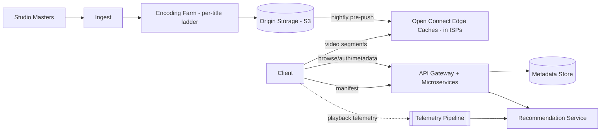

## 1. Requirements

**Functional**

- Browse/search a catalog; personalized home page.
- Stream video with fast start and minimal rebuffering, on any device/network.
- Resume playback across devices; track watch history.
- (Upload/encode pipeline is internal — studios ingest content, not users.)

**Non-functional**

- **Startup latency** and **rebuffer rate** are the product metrics that matter.
- Massive egress: video dominates internet traffic — bandwidth cost is a first-class design constraint.
- Catalog metadata: high read volume, small data, must be snappy globally.
- Streaming availability >> consistency everywhere (watch history can lag).

## 2. Capacity estimation

Assume 200M subscribers, 100M hours watched/day.

| Metric | Estimate |
| --- | --- |
| Concurrent peak streams | ~10M |
| Per-stream bitrate | ~3 Mbps average (SD→4K ladder) |
| Peak egress | 10M × 3 Mbps ≈ **30 Tbps** — impossible from origin datacenters |
| Catalog | ~10K titles × ~100 encoded artifacts each — petabytes at origin |
| Metadata reads | Hundreds of thousands/sec, ~KBs each — cache-friendly |

30 Tbps of egress is the whole story: **the design is the CDN**. Everything else is a normal microservices control plane.

<!--more-->

## 3. The core question: getting bits near the viewer

### Push, not pull

Generic CDNs pull content on cache miss. At Netflix scale you **pre-push**: popularity is highly predictable (regional top-N covers most viewing), so during off-peak hours you proactively copy the regional catalog onto edge caches — including appliances placed *inside ISP networks* (Netflix Open Connect). A cache miss at the edge is the exception, not the norm.

### Adaptive bitrate streaming (ABR)

Each title is transcoded into a **bitrate ladder** (e.g. 240p→4K) and chopped into small segments (2–10s). A manifest (HLS/DASH) lists every rendition; the *client* measures throughput and buffer level and picks the next segment's quality. Quality shifts mid-stream instead of stalling — rebuffering is the metric ABR exists to kill.

## 4. High-level architecture

The split to emphasize: the **control plane** (auth, browse, recommendations, manifest URLs — small JSON over normal HTTPS) is completely separate from the **data plane** (video segments from edge caches). Control-plane outages shouldn't stop already-playing streams.

## 5. Deep dives

### Encoding pipeline

Each master fans out into (codec × resolution × bitrate) jobs across a compute farm — hours of parallel work per title, embarrassingly parallel by segment. Per-title encoding analyzes content complexity to pick the ladder (cartoons compress far better than action films), saving double-digit bandwidth percentages.

### Playback session flow

1. Client requests a title → control plane authorizes (subscription, region/DRM).
2. Steering service returns manifest + URLs for the *best edge* (ISP-local appliance first, then regional).
3. Client fetches segments, ramping bitrate up as the buffer fills.
4. Telemetry (startup ms, rebuffers, bitrate switches) streams back for steering and A/B decisions.

### Watch history & resume

Small, write-frequent, per-user — a wide-column store (Cassandra) keyed by user, eventually consistent. A resume point a few seconds stale is invisible; unavailability is not. Classic AP choice.

### Recommendations

Offline: batch pipelines over viewing telemetry train models nightly. Online: a serving layer assembles the personalized home page from precomputed rows + real-time signals, cached per user for minutes.

## 6. Trade-offs recap

| Decision | Chose | Cost |
| --- | --- | --- |
| Distribution | Pre-push to ISP-embedded caches | Fleet of hardware to operate; stale-content risk |
| Streaming | ABR over HTTP (HLS/DASH) | Client complexity; many artifacts per title |
| Watch history | AP wide-column store | Occasional stale resume point |
| Encoding | Per-title ladders | Big compute bill up front |

Frame the answer around the two planes and the egress math — an interviewer hearing "30 Tbps can't come from origin, so the CDN *is* the architecture" knows you've got the core insight.
