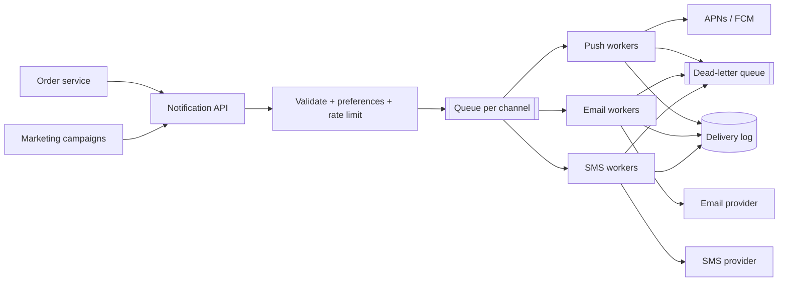

## 1. Requirements

**Functional**

- Send notifications over multiple channels: mobile push (APNs/FCM), email, SMS, in-app.
- Triggered by other services (order shipped, new follower) and by scheduled campaigns.
- User preferences: per-channel opt-outs, quiet hours, digests.

**Non-functional**

- Scale: tens of millions of notifications/day, campaign bursts of millions in minutes.
- **At-least-once delivery** with dedup — a dropped "payment failed" alert is worse than a duplicate.
- Not latency-critical (seconds are fine) except transactional alerts (OTP: near-real-time).
- Never spam: global and per-user rate caps are a correctness requirement, not a nicety.

## 2. High-level architecture

Producers call one API with a *template ID + user ID + payload* — never raw content per channel. The service resolves preferences, renders templates, and fans out to per-channel queues consumed by stateless worker pools.

## 3. The core decisions

### Queue per channel, not one big queue

Channels fail independently (SMS provider degraded ≠ push degraded) and have different throughput/cost profiles. Separate queues isolate backpressure: a Twilio outage backs up the SMS queue while push continues. Within a channel, add a **priority lane** — OTPs must not sit behind a 5M-user marketing blast.

### Delivery guarantees

Exactly-once doesn't exist across third-party providers. Design for **at-least-once + idempotent dedup**:

- Producer attaches an idempotency key (`event_id`).
- Workers check/set the key in Redis (`SETNX` with TTL) before dispatching.
- Provider callbacks (delivery receipts, bounces) update the delivery log.
- Failures retry with exponential backoff + jitter; poison messages go to a **dead-letter queue** with alerting, not infinite retry.

### Rate limiting and collapsing

Two distinct limits: per-user caps ("max 5 pushes/day from marketing" — protect the user) and per-provider caps (APNs/SES throttle you — protect the pipeline). Add **notification collapsing**: 40 likes in an hour becomes "Alex and 39 others liked your post", implemented by buffering low-priority events per user and flushing on a timer.

## 4. Deep dives

### User preferences & quiet hours

Preference checks are on the hot path of every send — cache the preference blob per user (Redis, ~1 KB) with invalidation on settings change. Quiet hours require the user's timezone; a scheduled-delivery queue (deliver at 9am local) falls out of the same mechanism.

### Templates

Store versioned templates centrally; producers send data, not prose. This gives consistent copy, localization in one place, and — critically — the ability to kill a bad campaign template without redeploying producer services.

### Device token lifecycle

Push tokens go stale constantly (app reinstall, OS refresh). Handle provider feedback (`Unregistered` from FCM) by pruning tokens immediately — repeatedly pushing to dead tokens gets your sender reputation throttled.

### Observability

The number-one operational question is "did user X get the OTP and if not, where did it die?" The delivery log must record every state transition (accepted → rendered → dispatched → provider-acked → delivered/bounced), queryable by user and by notification ID. Design it as an append-only event table.

## 5. Trade-offs recap

| Decision | Chose | Cost |
| --- | --- | --- |
| Delivery | At-least-once + dedup keys | Rare duplicates still possible |
| Topology | Queue per channel + priority lanes | More queues to operate |
| Preferences | Cached per-user blob | Staleness window on settings change |
| Failures | Backoff + DLQ | Manual DLQ triage needed |

A notification system is a **reliability and courtesy** problem wearing a messaging costume: idempotency, backpressure isolation, and per-user rate caps are the answers interviewers are fishing for.
