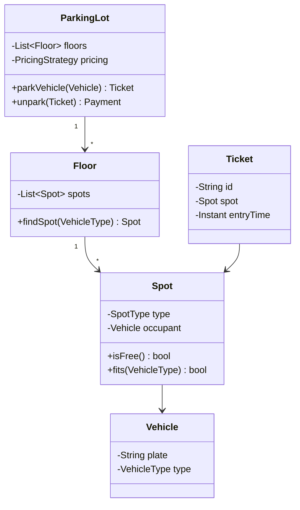

The parking lot is the "two sum" of LLD: everyone prepares it, so the bar is not *solving* it but showing clean process — requirements → entities → relationships → behavior → extension points.

## 1. Scope it first

Nail down with the interviewer (2 minutes, big signal):

- Multiple floors; spot types (motorcycle / compact / large / EV / handicapped).
- A vehicle takes one spot of a compatible type (keep it simple; note the "bus takes 5 spots" variant exists).
- Ticket on entry, pay on exit; hourly pricing varying by spot type.
- Display available counts per floor.

## 2. Core model



**Enum vs subclass** — the recurring LLD judgment call. `Vehicle` differs only by *data* (type, size) → an enum field is enough; subclassing `Motorcycle extends Vehicle` adds ceremony without behavior. If types later gain real behavior differences, refactor then. Saying this reasoning out loud is worth more than either choice.

## 3. The interesting behavior: spot allocation

Don't scan all spots linearly per arrival. Keep **a free-list per spot type per floor** (e.g., `Map<SpotType, TreeSet<Spot>>` ordered by spot number or distance-from-entrance):

- `parkVehicle`: pick the allocation *strategy* — nearest-to-entrance, lowest floor first, spread across floors. Make it a `SpotAllocationStrategy` interface (Strategy pattern) so the policy is swappable.
- Compatibility: a motorcycle may take a compact spot when motorcycle spots are exhausted — encode in `fits()`, ordered by preference.
- **Concurrency**: two gates allocating simultaneously must not grab one spot. In-process: lock per floor or a concurrent set with atomic claim. Say the sentence; LLD interviewers listen for it.

## 4. Pricing — Strategy again

```text
interface PricingStrategy { Money price(Ticket t, Instant exit); }
HourlyPricing        — ceil(hours) × rate[spotType]
DayCapPricing        — hourly, capped per 24h
EventFlatPricing     — flat rate during events
```

Composing (hourly + weekend multiplier) suggests Decorator; a config-driven rate table is honestly fine too — offer the pattern, admit the simple alternative.

## 5. Tickets, payment, and edge cases

- Lost ticket → fine + max-day charge (policy object, not an `if` buried in code).
- Payment via `PaymentMethod` interface (card/cash/UPI) — classic polymorphism showcase.
- Full lot → `parkVehicle` returns/throws a typed result; the display board subscribes to spot events (Observer) rather than polling floors.

## 6. What interviewers grade

| Signal | How you show it |
| --- | --- |
| Requirements discipline | Asked about spot types, floors, pricing *before* classes |
| Modeling judgment | Enum-vs-subclass reasoning; small interfaces |
| Pattern fluency without cargo-culting | Strategy for allocation/pricing, Observer for display — each justified |
| Correctness instincts | Free-list efficiency, concurrent gate claim |
| Extensibility story | "EV spots with chargers = new SpotType + fits() rule + rate row — no class explosion" |

Rehearse drawing the class diagram in under five minutes; spend the saved time on allocation strategy and concurrency, where the actual differentiation lives.
