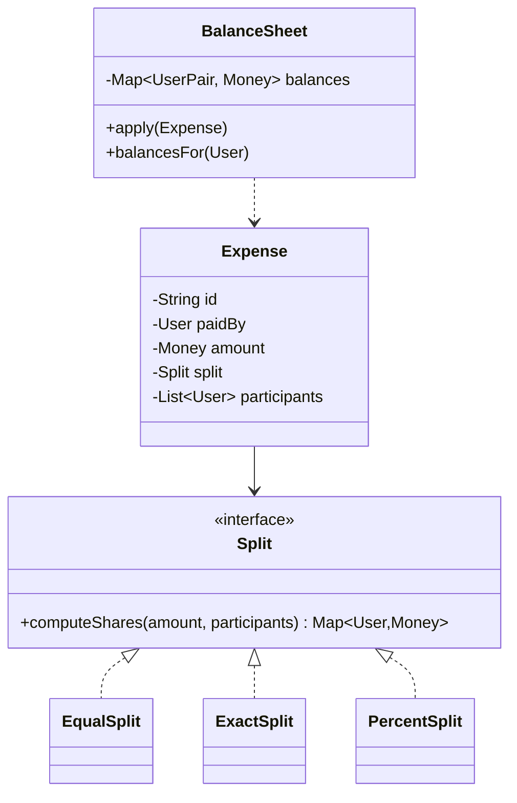

Splitwise is a favorite LLD prompt because it layers three distinct tests: clean domain modeling (expenses, groups), a strategy hierarchy (split types), and a genuine algorithm (debt simplification) — plus a money-handling trap that catches most candidates.

## 1. Scope

- Users add expenses: who paid, how much, split among whom — equally, by exact amounts, or by percentages.
- Anyone can view balances: "who owes whom how much", per group and overall.
- Settle-up records a repayment. Simplify-debts minimizes the number of transactions.

## 2. The key modeling decision: store balances, not debts-per-expense

Naive model: each expense creates little IOU records, and balance queries scan all history. Correct model: expenses are an **immutable ledger** (audit trail), and a running **balance sheet** — `Map<(userA,userB), amount>` — is updated as each expense lands. Queries are O(1); history remains replayable. This event-log + derived-state framing is the single highest-value sentence in the interview.



`Split` is the textbook Strategy: `computeShares` returns each participant's share, with validation per type (exact amounts must sum to the total; percentages to 100). Adding "split by shares/weights" later = one new class.

## 3. The money trap: rounding

₹100 split three ways is 33.33 + 33.33 + 33.33 = 99.99 — one paisa evaporates. Rules that make you look like you've handled money before:

- **Never use floats.** Store minor units (paise/cents) as integers, or a decimal type.
- Distribute the remainder deterministically: each share = `floor(amount/n)`, then give the leftover paise to the first `remainder` participants (or to the payer). Document the rule; sum of shares **must** equal the total, checked with an assertion.

## 4. The algorithm: simplify debts

Balances form a directed graph (edge u→v = u owes v). Simplification: compute each user's **net balance** (total owed to them minus total they owe) — the individual edges don't matter, only the nets. Then repeatedly match the largest debtor with the largest creditor:

```text
net = {user: +credit / -debt}          # sums to zero
creditors = max-heap by net, debtors = max-heap by |net|
while heaps non-empty:
    settle min(largest debtor, largest creditor)
    push back whichever side has remainder
```

Greedy matching yields at most n−1 transactions and is the expected answer. (True minimum transaction count is NP-hard via subset-sum matching — knowing that footnote is a flex; nobody expects you to implement it.)

Note the product nuance: simplification *rewires who pays whom* — B may end up paying C despite never transacting with them. Real Splitwise makes it an opt-in group setting. Mentioning consent shows product sense.

## 5. Concurrency & persistence notes

- Two members adding expenses to one group concurrently: serialize balance-sheet application per group (a lock or per-group queue) — the ledger append is naturally safe, the derived balances are not.
- Settle-up is just another ledger event (`Payment`), flowing through the same `apply` path — one code path, no special cases.

## 6. What interviewers grade

| Signal | How you show it |
| --- | --- |
| Domain modeling | Immutable expense ledger + derived balance sheet |
| Strategy fluency | Split hierarchy with per-type validation |
| Money correctness | Integer minor units + deterministic remainder rule |
| Algorithm | Net balances + two-heap greedy, n−1 transactions |
| Product sense | Simplification changes counterparties → opt-in |

The rounding paragraph and the net-balance insight are where offers are won; the class diagram is table stakes.
