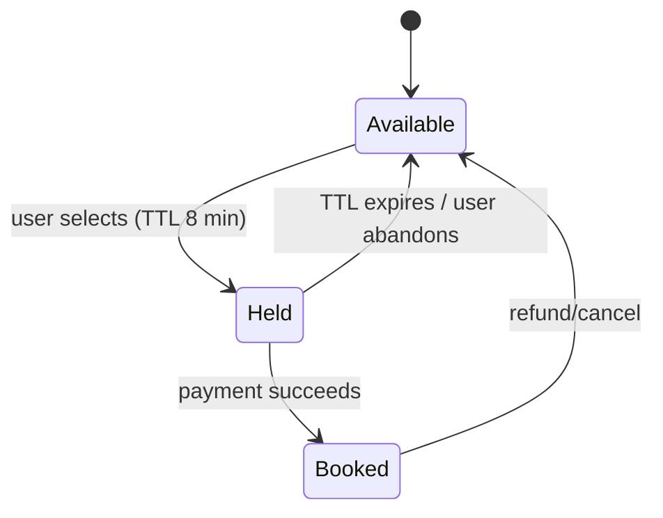
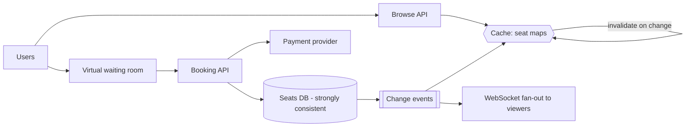

## 1. Requirements

**Functional**

- Browse events, view a venue's seat map with live availability.
- Select seats → hold them briefly → pay → confirmed booking.
- Exactly one owner per seat. **Zero double-bookings, ever.**

**Non-functional**

- Traffic is violently spiky: a big on-sale sends 500K users at 10:00:00 for 50K seats.
- Booking must be strongly consistent; browsing can be eventually consistent.
- Payment (third-party, seconds-slow) must not hold database locks.

## 2. The core problem: contention, not scale

Total data is tiny (an arena is ~50K rows). The challenge is thousands of users racing for the *same* rows in the same second. Everything in this design is about managing that contention.

### The booking state machine



The **hold with TTL** is the crux. Payment takes ~minutes and can fail; you cannot leave seats locked in a DB transaction that whole time, and you cannot let two users pay for one seat. So: claim the seat *before* payment with an expiring hold.

### Implementing the hold

Atomic conditional update — either in the database:

```sql
UPDATE seats SET status='HELD', held_by=:user, hold_expires=now()+'8 min'
WHERE seat_id=:id AND event_id=:event
  AND (status='AVAILABLE' OR (status='HELD' AND hold_expires < now()));
-- 1 row updated = you got it; 0 rows = someone beat you
```

…or in Redis (`SET seat:{event}:{id} user EX 480 NX`) with the DB as source of truth at confirm time. Either way, the primitive is **compare-and-set, never read-then-write**. On payment success, a transaction flips `HELD → BOOKED` after re-verifying the hold is yours and unexpired.

## 3. High-level architecture



Browse traffic (the 95%) hits cached seat maps updated via change events — slightly stale is fine, the hold CAS is the real gatekeeper. Booking traffic hits the consistent store.

## 4. Deep dives

### The virtual waiting room

The honest answer to 500K simultaneous users for 50K seats: **don't let them all in**. A waiting room queues users at the edge (randomized or FIFO), admitting them at a rate the booking core can absorb. It converts a thundering herd into a steady stream, and it's *fairer* — a queue beats a lottery of retry storms. This is what Ticketmaster actually does; naming it is a strong signal.

### Preventing double-booking at confirm

Payment webhooks can arrive twice, late, or after hold expiry. Confirmation must be an idempotent transaction keyed by booking ID:
verify hold ownership + expiry → mark BOOKED → record payment ref. If the hold expired while payment succeeded (rare, awful), auto-refund and apologize — never bump the seat's new owner.

### Seat-map fan-out

Viewers watching the map shouldn't poll. Push seat-state deltas over WebSocket/SSE, throttled (batch changes every ~500 ms) — during an on-sale, per-seat events would flood clients.

### Scalpers and bots

Rate limits per account/device/card, CAPTCHA at waiting-room entry, purchase caps per event. Acknowledge it's an arms race; the waiting room helps by making automation queue like everyone else.

### Sharding

Natural key: **event ID**. One event's contention lands on one shard; a hot on-sale can get a dedicated instance warmed in advance. Cross-event queries (user's bookings) go to a separate read model.

## 5. Trade-offs recap

| Decision | Chose | Cost |
| --- | --- | --- |
| Hold mechanism | CAS + TTL (8 min) | Seats briefly unsellable after abandonment |
| Spike handling | Virtual waiting room | Users wait; UX must communicate honestly |
| Seat map | Cached + event-driven push | Seconds of staleness while browsing |
| Confirm | Idempotent transaction, re-verify hold | Rare refund path when hold lapses mid-payment |

Ticketmaster is the interview's favorite **correctness-under-contention** problem: the TTL hold state machine and the waiting room are the two ideas you must produce unprompted.
