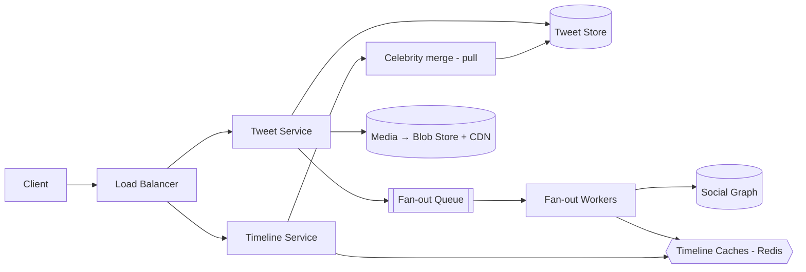

## 1. Requirements

**Functional**

- Post a tweet (text ≤ 280 chars, optional media).
- Follow / unfollow users.
- **Home timeline**: recent tweets from everyone you follow, newest first.
- User timeline, likes; search and notifications out of scope unless asked.

**Non-functional**

- Read-dominated: timeline reads outnumber tweet writes by ~100–1000×.
- Timeline load should feel instant (p99 well under a second).
- Eventual consistency is fine — a tweet appearing in followers' feeds a few seconds late is acceptable. Availability over consistency (AP lean).

## 2. Capacity estimation

Assume 200M DAU, 100M tweets/day, each user checks their timeline 10×/day.

| Metric | Estimate |
| --- | --- |
| Tweet writes | 100M/day ≈ **1,200/sec** (peaks 5–10×) |
| Timeline reads | 2B/day ≈ **23,000/sec** |
| Tweet storage | 100M × ~1 KB ≈ 100 GB/day (media on blob storage + CDN) |
| Follow graph | Billions of edges — must be partitioned |

The 20:1 read/write gap is the whole design: you either do work on write to make reads free, or vice versa.

<!--more-->

## 3. The core question: fan-out

### Fan-out on read (pull)

Store tweets once, indexed by author. To build a timeline: fetch the follow list, query recent tweets per followee, merge by time.

- ✅ Writes are trivial; no wasted work for inactive readers.
- ❌ Reads touch hundreds of partitions per request — expensive exactly where the load is heaviest.

### Fan-out on write (push)

When a user tweets, insert the tweet ID into a **precomputed timeline cache** (e.g. a Redis list) for every follower.

- ✅ Reads are one cache fetch — perfect for the read-heavy ratio.
- ❌ A user with 100M followers triggers 100M writes per tweet (the **celebrity problem**); wasted work for dormant accounts.

### The hybrid everyone converges on

Push for normal users; **pull for celebrities**. A timeline read fetches the precomputed list, then merges in recent tweets from followed celebrities at read time. Cap precomputed lists (~800 entries) and skip fan-out for users inactive for weeks — rebuild their timeline lazily on next login.

## 4. High-level architecture

Tweet flow: persist to the tweet store → enqueue a fan-out job → workers read the follower list and push the tweet ID into each follower's timeline cache. The queue absorbs write spikes and retries.

Timeline flow: read the Redis list → hydrate tweet IDs from the tweet store (with its own cache) → merge celebrity tweets → return.

## 5. Deep dives

### Timeline cache layout

`timeline:{userId}` → Redis list/ZSET of ~800 tweet IDs. Storing IDs (not bodies) keeps memory sane and lets tweet edits/deletes stay consistent — deletion removes the body; dangling IDs are filtered at hydration.

### Social graph storage

Adjacency lists in a partitioned KV store: `followers:{userId}` and `following:{userId}`, sharded by user ID. Fetching 10M followers for fan-out streams in batches through the queue, not one giant read.

### Tweet IDs

Time-sortable IDs (Snowflake: timestamp + worker + sequence) let lists sort by ID alone and make cursor pagination trivial.

### What breaks first

Fan-out workers lag during global events (everyone tweets at once). Because the queue decouples them, timelines just go slightly stale rather than dropping writes — an explicitly acceptable trade under the AP lean.

## 6. Trade-offs recap

| Decision | Chose | Cost |
| --- | --- | --- |
| Fan-out | Hybrid push/pull | Two code paths, celebrity threshold to tune |
| Consistency | Eventual for timelines | Seconds of staleness under load |
| Cache contents | Tweet IDs only | Hydration adds a hop |
| Inactive users | No precompute | First load after absence is slow |

Lead with the read/write ratio, name both fan-out strategies, then land on the hybrid — and volunteer the celebrity problem before the interviewer raises it.
