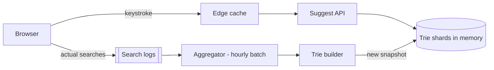

## 1. Requirements

**Functional**

- As the user types, return the top 5–10 most likely completions for the prefix.
- Suggestions ranked by popularity (query frequency), ideally freshened as trends change.

**Non-functional**

- **Latency is the product**: suggestions must render within ~100 ms end-to-end, so the service must answer in **< 20 ms**.
- Massive read skew: every keystroke is a read; writes (frequency updates) are batch.
- Availability over consistency — a slightly stale suggestion list is invisible to users.

## 2. Capacity estimation

Assume 5B searches/day, average query 4 keystrokes producing a request each.

| Metric | Estimate |
| --- | --- |
| Suggestion reads | 5B × 4 / 86,400 ≈ **230K QPS** |
| Distinct queries tracked | ~1B strings, avg 30 bytes ≈ 30 GB raw |
| Precomputed top-K per prefix | dominates storage — see below |

230K QPS at sub-20ms means: everything is precomputed and served from memory. No ranking at read time.

## 3. The core question: how do you serve a prefix in O(1)?

**Naive**: `SELECT ... WHERE query LIKE 'pre%' ORDER BY freq DESC LIMIT 10`. A table scan per keystroke — dead on arrival.

**Trie**: walk to the prefix node, explore the subtree for the top-K completions. Correct, but subtree exploration at read time is unbounded — the `a` subtree contains hundreds of millions of leaves.

**Trie + precomputed top-K at every node** (the answer): each node stores its top 10 completions, computed offline. A read is: walk ≤ len(prefix) pointers, return the cached list. O(prefix length), effectively O(1).

The cost is storage — every query contributes to every prefix node on its path — and update complexity: a frequency change must propagate up the tree. That's why updates are **batch, offline**.

## 4. High-level architecture

**Read path**: keystroke → edge cache (short prefixes like `a`, `th` are extremely cacheable with a 1h TTL) → suggest service → in-memory trie shard → cached top-K.

**Write path**: search logs → hourly aggregation (count queries, decay old counts) → rebuild/patch tries offline → swap in the new snapshot atomically (blue-green at the data level).

## 5. Deep dives

### Sharding the trie

Shard by prefix range, not naive first-letter (the `s` shard would melt while `x` idles). Use historical load to draw range boundaries (`a`–`aq`, `ar`–`bz`, …) — the same idea as range-partitioned databases with load-aware splits.

### Freshness vs "Taylor Swift ticket drop"

Hourly batch rebuilds miss sudden trends. Hybrid fix: keep the batch trie as the base, plus a small **real-time layer** — a sliding-window count (last ~10 min) of hot queries merged into results at read time. Trending queries surface in minutes; the heavy structure still updates lazily.

### Ranking beyond raw frequency

Time-decayed counts (yesterday matters more than last year), personalization (user's own history first), locale/language partitioning — each is a scoring tweak in the offline builder, not a read-path change. That separation is the design's key virtue: state it.

### Client-side hygiene

Debounce keystrokes (~50 ms), cancel in-flight requests when a new character arrives, and cache prefix→results in the browser session. Cheap, and interviewers reward remembering the client exists.

### Filtering

Profanity/abuse filtering happens at build time (never suggest it), plus a fast deny-list check at serve time for late removals — e.g., legal takedowns that can't wait for the next batch.

## 6. Trade-offs recap

| Decision | Chose | Cost |
| --- | --- | --- |
| Data structure | Trie with per-node top-K | Big storage; offline updates only |
| Freshness | Batch base + real-time hot layer | Two systems, merge logic |
| Sharding | Load-aware prefix ranges | Rebalancing machinery |
| Consistency | Eventual everywhere | Suggestions lag reality by minutes |

Typeahead is the cleanest example of the **precompute-everything** pattern: move all the work to write time, because reads outnumber writes 1000:1 and carry a hard latency budget.
