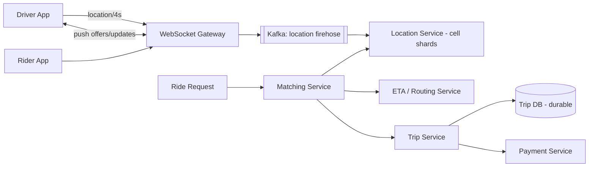

## 1. Requirements

**Functional**

- Riders request a ride from point A to B; nearby drivers are matched.
- Live driver locations on the rider's map, before and during the trip.
- Trip lifecycle: request → match → pickup → in-progress → complete → payment.
- ETA estimates and surge pricing (mention, don't deep-dive unless asked).

**Non-functional**

- Matching must feel instant (a few seconds end to end).
- Location pipeline handles millions of concurrent drivers pinging every ~4s.
- Trip state must be durable — losing an in-progress trip is unacceptable.
- Location data is high-volume but *disposable*; trip records are the opposite.

## 2. Capacity estimation

Assume 5M concurrent drivers at peak, pinging location every 4 seconds.

| Metric | Estimate |
| --- | --- |
| Location updates | 5M / 4s ≈ **1.25M writes/sec** |
| Update payload | ~100 bytes → ~125 MB/sec firehose |
| Ride requests | ~50K/min peak ≈ 1K/sec — tiny next to locations |
| Trip records | Tens of millions/day × ~2 KB — modest, but must be durable |

The design splits cleanly in two: a **stateless, in-memory location pipeline** (huge volume, zero durability needs) and a **transactional trip system** (small volume, strict durability).

<!--more-->

## 3. The core question: finding nearby drivers

Naive `WHERE lat BETWEEN … AND lng BETWEEN …` on 5M moving rows can't keep up. You need a spatial index that supports **cells**:

**Geohash / S2 / H3** — encode the world into hierarchical cells; a driver's cell ID is a string/integer key. "Nearby" = query the rider's cell plus its 8 neighbors (handles cell-boundary cases). Uber built H3 (hexagons — uniform neighbor distances) for exactly this.

**In-memory cell → drivers map** — keep `cell → {driverId → (lat, lng, heading, ts)}` in a sharded in-memory store (Redis or a custom service), updated by the location firehose. Location data is ephemeral: if a node dies, it repopulates within one ping cycle — no persistence required.

Matching flow: rider request → compute cell + neighbors → pull candidate drivers → rank by ETA (road distance, not straight-line) → offer the ride to the top driver(s) with a short acceptance timeout, cascading on decline.

## 4. High-level architecture

**Persistent connections**: both apps hold WebSocket (or MQTT) connections through a gateway — drivers push locations up, and the matcher pushes ride offers down the same pipe. A connection registry maps `userId → gateway node` so any service can reach any device.

## 5. Deep dives

### Sharding the location service

Shard by cell ID, not driver ID — nearby-driver queries then hit one or two shards. Hot downtown cells can be split to finer resolution (H3 supports multi-resolution natively). Drivers crossing cell boundaries move between shards; their TTL'd entries in the old cell simply expire.

### The matching handshake

Matching is a distributed transaction-lite: mark the driver *pending* (with lease/timeout), send the offer, and on accept atomically flip driver → busy and trip → matched. Optimistic locking on driver state prevents double-booking; expired leases release automatically.

### Trip state machine

`REQUESTED → MATCHED → ARRIVING → IN_PROGRESS → COMPLETED / CANCELLED` in a strongly consistent store (Postgres/Spanner-class). Every transition is an event on a bus — receipts, analytics, and fraud consume downstream without touching the critical path.

### Location history

The raw firehose also lands in cold storage (S3/Parquet) from Kafka for ETA model training and dispute resolution — but that's an offline consumer, never in the matching path.

## 6. Trade-offs recap

| Decision | Chose | Cost |
| --- | --- | --- |
| Spatial index | H3/geohash cells in memory | Boundary queries need neighbor cells |
| Location durability | None (repopulates in seconds) | Brief blind spot on node failure |
| Location shards | By cell | Hot-city shards need splitting |
| Matching | Lease + timeout handshake | Declines add seconds of latency |
| Trip store | Strongly consistent SQL | Lower write ceiling — fine at trip volume |

The interview signal: recognize the two-system split (ephemeral location vs durable trips), name a real spatial index, and walk the matching handshake including the failure case where a driver never responds.
