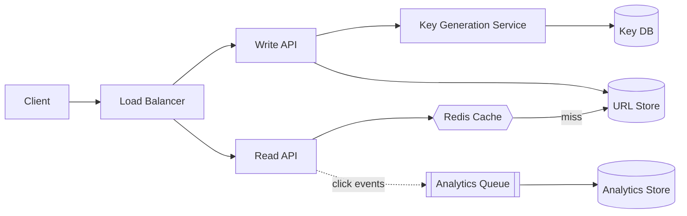

## 1. Requirements

**Functional**

- Given a long URL, return a short alias (e.g. `sv.ly/x7Kp2a`).
- Visiting the alias redirects to the original URL.
- Optional: custom aliases, expiration, click analytics.

**Non-functional**

- Extremely **read-heavy**: redirects outnumber creations ~100:1.
- Redirect latency must be minimal — this sits in the critical path of someone else's page load.
- High availability: a downed shortener breaks links across the internet.
- Aliases must not be guessable enough to enumerate (mild privacy concern).

## 2. Capacity estimation

Assume 100M new URLs/month and a 100:1 read ratio.

| Metric | Estimate |
| --- | --- |
| Writes | 100M / month ≈ **40 URLs/sec** |
| Reads | 4,000 redirects/sec (peaks ~2–3×) |
| Storage per record | ~500 bytes (URL, alias, metadata) |
| Storage over 5 years | 6B records × 500B ≈ **3 TB** |
| Cache for hot URLs | 20% of daily reads ≈ tens of GB — fits in memory |

Two takeaways: storage is small (a single well-indexed database can hold it), and the problem is dominated by **read latency**, which caching solves.

## 3. The core question: generating short codes

A 6-character code over `[a-zA-Z0-9]` (base62) gives 62⁶ ≈ **56.8 billion** combinations — plenty.

**Option A — hash the URL (MD5/SHA, take first 6 chars).** Collisions must be detected and re-salted; two users shortening the same URL get the same code (sometimes desired, sometimes a privacy leak).

**Option B — auto-increment counter, base62-encode.** No collisions ever. But sequential output (`x7Kp2a`, `x7Kp2b`, …) is enumerable, and a single counter is a write bottleneck and single point of failure.

**Option C — Key Generation Service (KGS).** Pre-generate random codes offline into a `keys` table; creation simply claims an unused key. No collisions at request time, no sequence to enumerate, and the KGS can hand out key *batches* to app servers so claiming is a local operation.

Option C (or B with distributed ranges — each server gets a counter range from ZooKeeper/etcd) is the answer interviewers want, with the trade-offs stated.

## 4. High-level architecture

**Write path**: validate URL → claim a key from the KGS batch → insert `(code, longUrl, owner, expiry)` → return alias.

**Read path**: look up code in Redis → on miss, read the DB and populate the cache → reply **301 or 302**.

- `301 Moved Permanently` lets browsers cache the redirect — less load for you, but you lose analytics on repeat clicks and can't change the target later.
- `302/307` keeps every click on your servers. Most real shorteners choose 302 *because* the analytics are the product.

## 5. Deep dives

### Database choice

The data is a single flat mapping with no relational structure — ideal for a key-value store (DynamoDB, Cassandra) partitioned by short code. Postgres with the code as primary key also works fine at this scale; say so, then note the KV store wins if you 10× the estimates.

### Caching strategy

Cache-aside with LRU eviction. URL popularity follows a steep power law — a cache holding the top few percent of codes serves the large majority of redirects. Set a TTL to bound staleness if URLs can be edited or expired.

### Analytics without slowing redirects

Never write analytics synchronously in the redirect path. Emit a click event (code, timestamp, referrer, coarse geo) to Kafka and aggregate downstream. The redirect answers in one cache hit; the analytics pipeline is eventually consistent.

### Expiration

Lazy deletion: check expiry on read and return 404/410, with a background sweeper reclaiming expired rows and returning their keys to the pool. Avoids a fleet of timers.

## 6. Trade-offs recap

| Decision | Chose | Cost |
| --- | --- | --- |
| Code generation | KGS / counter ranges | Extra service to operate |
| Redirect status | 302 | More origin traffic than 301 |
| Store | KV, partitioned by code | Rich queries need a side channel |
| Analytics | Async via queue | Eventually consistent counts |

A URL shortener is the classic warm-up case study: small data, huge read skew. Show the estimation, name the ID-generation options, and make the 301-vs-302 call explicitly — that's what separates a rehearsed answer from an engineered one.
