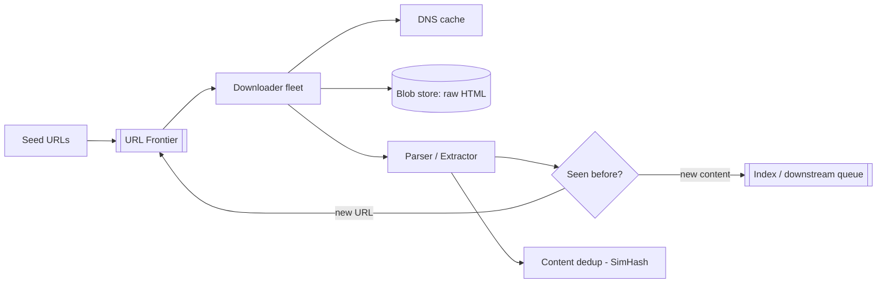

## 1. Requirements

**Functional**

- Given seed URLs, download pages, extract links, and keep crawling.
- Store page content for downstream consumers (search indexing, ML training).
- Re-crawl pages on a freshness schedule.

**Non-functional**

- Scale: ~1B pages per month.
- **Politeness**: never hammer a single host; obey `robots.txt`.
- Robustness: the real web is adversarial — spider traps, infinite calendars, duplicate content everywhere.
- Extensibility: pluggable processing (parse PDFs later, add media types).

## 2. Capacity estimation

| Metric | Estimate |
| --- | --- |
| Pages | 1B / month ≈ **400 pages/sec** sustained |
| Avg page | ~500 KB → ~200 MB/s download bandwidth |
| Storage / month | 1B × 500 KB ≈ **500 TB** (blob store, compressed) |
| URL metadata | 1B URLs × ~100 B ≈ 100 GB — fits a sharded KV store |

Bandwidth and politeness — not CPU — are the bottlenecks. That drives the whole design.

## 3. High-level architecture

The loop: frontier hands out URLs → downloaders fetch → parsers extract links → new links flow back into the frontier.

## 4. The core component: the URL frontier

A naive FIFO queue fails twice: it lets thousands of URLs from one host cluster together (politeness violation), and it ignores priority (news homepage vs page 9,000 of a forum).

The classic **Mercator design** uses two stages:

- **Front queues** — partitioned by *priority* (freshness needs, PageRank-ish importance, depth).
- **Back queues** — partitioned by *host*, one queue per host, each with a "next allowed fetch time" respecting `robots.txt` crawl-delay. A worker takes the host whose timer expired, fetches one URL, and re-arms the timer.

This guarantees per-host rate limits *structurally* — politeness isn't a check, it's the shape of the queue.

## 5. Deep dives

### URL dedup at scale

"Have I seen this URL?" happens billions of times. Options: a sharded hash set of URL fingerprints (exact, ~100 GB — fine), or a **Bloom filter** in memory (tiny, but false positives mean skipping never-crawled URLs — acceptable for a crawler, catastrophic for a payment system; say the trade-off out loud).

### Content dedup

~30% of the web is duplicate or near-duplicate content under different URLs. Exact dup: compare content hashes (SHA-256). Near-dup (boilerplate changes, tracking params): **SimHash** — similar documents produce hashes within a small Hamming distance, so you can index by hash bands and catch mirrors cheaply.

### Traps and adversarial pages

- **Spider traps**: infinitely deep auto-generated links (calendars, faceted search). Mitigate with max depth per host, max URLs per host, and URL pattern heuristics.
- Normalize URLs aggressively (case, trailing slash, sorted query params, strip `utm_*`) before dedup.
- Respect `robots.txt` — cache it per host with a TTL; fetch it *before* the first page of any host.

### Freshness

Not all pages deserve equal re-crawls. Track each page's observed change rate and schedule re-crawls proportionally (news portals hourly, static docs monthly). This turns re-crawling into the same priority machinery the front queues already have.

### DNS

At 400 fetches/sec, synchronous DNS lookups become a real bottleneck. Run a local caching resolver and prefetch resolution as URLs enter the back queues.

## 6. Trade-offs recap

| Decision | Chose | Cost |
| --- | --- | --- |
| Frontier | Mercator two-stage queues | More moving parts than FIFO |
| URL dedup | Bloom filter (+ exact store for authority) | Rare false-positive skips |
| Content dedup | SimHash banding | Approximate; tuning needed |
| Storage | Blob store for raw HTML, KV for metadata | Two systems to operate |

The crawler is a *politeness-constrained throughput* problem. Interviewers are listening for the frontier design, dedup at scale, and evidence you know the web fights back.
