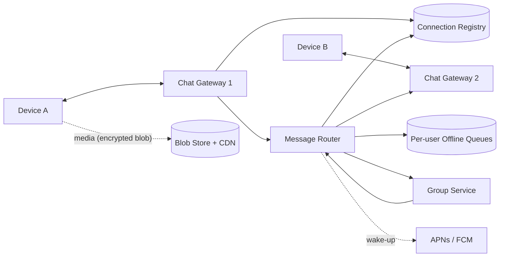

## 1. Requirements

**Functional**

- 1:1 chat with delivery states: sent ✓, delivered ✓✓, read (blue).
- Group chats (cap ~1000 members).
- Offline delivery: messages arrive when the recipient reconnects.
- Media messages; end-to-end encryption (E2EE) as a design constraint.

**Non-functional**

- Delivery latency ~100ms when both parties are online.
- **No message loss** — at-least-once delivery with dedupe (effectively exactly-once to the user).
- Billions of devices holding long-lived connections.
- E2EE means servers route ciphertext they cannot read — this shapes what features are even possible server-side.

## 2. Capacity estimation

Assume 2B users, 100B messages/day.

| Metric | Estimate |
| --- | --- |
| Message throughput | 100B/day ≈ **1.2M msgs/sec** (peaks 3–5×) |
| Concurrent connections | ~500M devices online |
| Connection servers | at ~1M conns/box (epoll + tuned TCP) → ~500–1000 gateways |
| Message payload | ~100 bytes ciphertext — bandwidth is trivial; **state is the cost** |
| Storage | Undelivered queue only; delivered messages live on devices |

The distinctive constraint: WhatsApp historically stores messages **only until delivered**. Server storage is a queue, not an archive — E2EE makes long-term server archives useless anyway.

<!--more-->

## 3. The core question: reliable delivery over flaky mobile networks

Every hop uses **acks + retries + idempotency**:

1. Sender assigns a client-generated message ID, sends over its socket, retries until the server acks (**✓ sent** = durably queued server-side).
2. Server looks up the recipient's gateway in a **connection registry** (`userId → gateway node`) and pushes; the recipient's device acks (**✓✓ delivered**), and the server deletes the queued copy.
3. Recipient offline? The message waits in the user's queue; on reconnect the device pulls everything pending. Push notifications (APNs/FCM) wake the app but are *only* a wake-up signal — never the delivery channel.
4. Read receipts are ordinary system messages flowing the reverse way.

Duplicates from retries are dropped by the client via message ID — at-least-once transport, exactly-once presentation.

## 4. High-level architecture

Gateways hold millions of persistent connections each and stay dumb; routing logic lives behind them. The registry (Redis-class) maps every online user to their gateway and is updated on connect/disconnect heartbeats.

## 5. Deep dives

### Group messages

Sender uploads once; the **server fans out** to N member queues (never N uploads from the phone). With E2EE, "sender keys" let one ciphertext serve the whole group rather than encrypting per member. The ~1000-member cap keeps fan-out bounded — contrast with Twitter's unbounded follower fan-out.

### Ordering

Global ordering is unnecessary; **per-conversation** ordering is what users perceive. Server sequence numbers per conversation let clients display consistently and detect gaps (triggering a fetch of missed messages).

### Media

Ciphertext blobs go to blob storage via presigned URLs; the chat message carries only the blob key + decryption key (inside the E2EE envelope). Chat infrastructure never touches media bytes; CDN serves downloads.

### E2EE implications (Signal protocol)

Servers store public **prekey bundles** for session setup and route ciphertext. Consequences worth volunteering: no server-side search of history, no server-rendered previews, multi-device requires per-device sessions — feature constraints, not just security trivia.

## 6. Trade-offs recap

| Decision | Chose | Cost |
| --- | --- | --- |
| Delivery | At-least-once + client dedupe | Retry machinery on every hop |
| Storage | Delete after delivery | No server-side history/backup (device exports instead) |
| Ordering | Per-conversation only | Cross-chat ordering undefined |
| Groups | Server fan-out, capped size | Large groups need a different design (channels) |
| E2EE | Signal protocol | Kills server-side features; multi-device complexity |

Anchor the answer on the ack chain behind ✓/✓✓ — it demonstrates you think in delivery guarantees, which is the entire substance of a messaging system.
