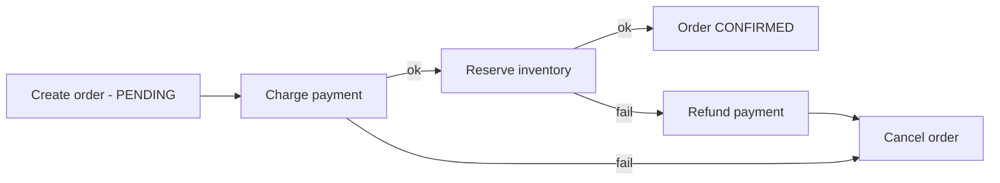

An order placement touches the order service, payment service, and inventory service — three databases. There is no `BEGIN TRANSACTION` spanning them. What replaces it is the most quietly important topic in microservice design.

## Two-Phase Commit (2PC) — and why it's rare

A coordinator asks all participants to **prepare** (lock resources, promise to commit), then — if all vote yes — to **commit**.

It gives real atomicity, but: participants hold locks while waiting (latency stacks), and a crashed coordinator leaves everyone **blocked in prepared state**, locks held, until it recovers. It requires all parties to speak the protocol (third-party APIs don't). Verdict interviewers expect: used *inside* tightly-coupled infrastructure (distributed SQL databases use 2PC internally, coordinated by consensus), avoided *between* services.

## Sagas — the microservice answer

A saga breaks the transaction into **local transactions**, each atomic in its own service, linked by events or commands. If step N fails, previously completed steps are undone by **compensating actions** — semantic rollbacks.

- **Choreography**: each service reacts to events (`PaymentCompleted` → inventory reserves). No central brain — but the flow exists only in everyone's heads; debugging "where is order 123 stuck" is archaeology. Fine for 2–3 steps.
- **Orchestration**: a saga orchestrator (state machine) commands each step and tracks state. One place to see, retry, and time-out the flow. The default for anything ≥3 steps or money-touching.

Two truths to state out loud: intermediate states are **visible** (the order says PENDING — design the UX for it), and compensations are business logic, not magic (a refund is not an un-charge; an email can't be unsent — some steps are only *mitigable*).

## The dual-write problem & the outbox pattern

Inside each step lurks a trap: "update my DB **and** publish the event." Two systems, no shared transaction — crash between them and the saga silently stalls.

**Transactional outbox**: in the *same local transaction* as the business write, insert the event into an `outbox` table. A relay (poller or CDC tailing the DB log) publishes outbox rows to the broker and marks them sent. The DB transaction is the single source of atomicity; the event now happens **iff** the write happened.

Delivery becomes at-least-once — which is fine, because…

## Idempotency everywhere

At-least-once delivery means every consumer sees duplicates eventually. Every saga step must be idempotent:

- Carry a unique ID (order ID, event ID) end to end.
- Consumers record processed IDs (unique constraint / `SETNX`) and no-op on repeats.
- External calls use the provider's idempotency keys (Stripe et al. support this natively).

Retries + idempotency + eventual consistency is the actual "distributed transaction" most systems run on.

## Choosing

| Situation | Answer |
| --- | --- |
| One service, one DB | A plain ACID transaction. Don't distribute what you can avoid distributing. |
| Two tightly-coupled internal stores | Consider merging them, or 2PC if infra supports it |
| Multi-service business flow | Saga (orchestrated), outbox for events, idempotent consumers |
| Read-only cross-service view | No transaction — CQRS/read model fed by events |

## Interview Q&A

**Q: Payment succeeded but inventory reservation keeps failing. Now what?**
A: The orchestrator retries with backoff; on exhaustion it runs compensation — refund payment, cancel order, notify the user. If even compensation fails, the saga parks in a dead-letter state with alerting for human resolution. "Escalate to humans" is a legitimate terminal state; pretending otherwise is the red flag.

**Q: Why not just call both services synchronously and check both succeeded?**
A: The failure window between calls leaves half-done state with no record; retries double-charge without idempotency; and the caller crashing orphans the flow entirely. That's a saga without the safety rails.

**Q: Outbox vs publishing directly to Kafka in the handler?**
A: Direct publish + DB write is a dual write — either can fail alone. The outbox rides the DB transaction, so event emission is atomic with state change; CDC/poller handles actual delivery.

**Q: Where does exactly-once processing come from?**
A: Nowhere — the network gives you at-least-once (or at-most-once). "Effectively-once" is engineered at the edges: idempotent consumers + dedup keys.
