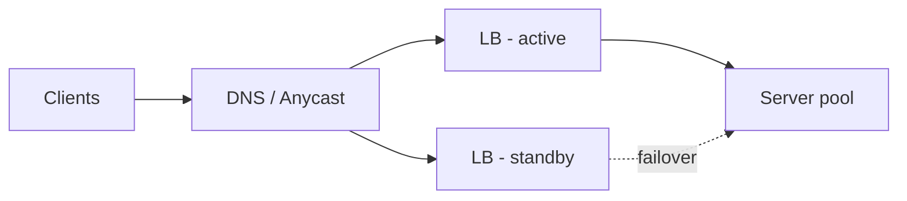

A load balancer spreads incoming traffic across a pool of servers, turning N machines into one logical endpoint. It's also the layer where health checking, TLS termination, and rollout tricks (canary, blue-green) live.

## L4 vs L7

| | L4 (transport) | L7 (application) |
| --- | --- | --- |
| Sees | IPs + ports | Full HTTP: path, headers, cookies |
| Speed | Faster, dumb pipes | Slightly slower, smart |
| Routing | Per-connection | Per-request: `/api/*` → service A, sticky cookies, header-based canary |
| Examples | AWS NLB, IPVS | Nginx, Envoy, AWS ALB |

Most stacks use both: an L4 tier at the edge for raw throughput, then L7 for routing between services.

## Algorithms

- **Round robin** — default; fine when requests are uniform.
- **Weighted round robin** — heterogeneous hardware or gradual rollouts (send 5% to the canary).
- **Least connections** — better when request durations vary wildly (long polls, uploads).
- **Consistent hashing** — same client/key → same server; matters when servers hold per-key cache state (see [consistent hashing]).
- **Sticky sessions** — cookie-pinned; a crutch for stateful servers. Prefer statelessness and treat stickiness as a smell to explain, not a design goal.

## Health checks & failure handling

The LB probes each backend (`/healthz` every few seconds) and ejects failures until they recover. Two design points interviewers like:

- **Shallow vs deep checks.** A shallow check ("process is up") misses a server whose DB connection died. A deep check catches it — but if the *DB* is down, deep checks eject **every** backend and turn a partial outage into a total one. Common answer: shallow for ejection, deep for alerting.
- **The LB itself can't be a SPOF.** Standard pattern: a redundant LB pair with a floating IP (VRRP/keepalived), or DNS-level spreading across multiple LB nodes — plus anycast at serious scale.

## Interview framing

Say *where* the LB sits (edge, and again between internal tiers), *which layer* it operates at and why, and how health checking behaves during partial failure. That last one is what separates a memorized diagram from operational understanding.
