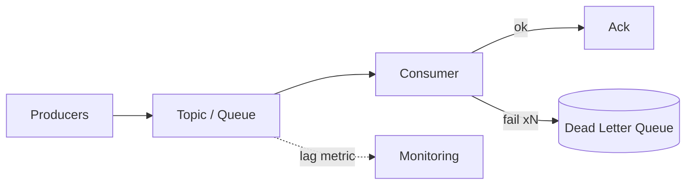

A message queue decouples producers from consumers: the producer enqueues and moves on; consumers process at their own pace. You reach for one when work is **deferrable** (emails, thumbnails, fan-out), when you need to **absorb spikes** (buffer bursts instead of crashing), or when services shouldn't know about each other (event-driven integration).

## Queues vs event logs

| | Task queue (SQS, RabbitMQ) | Event log (Kafka, Kinesis) |
| --- | --- | --- |
| Message after consumption | Deleted | Retained; consumers track offsets |
| Consumers | Compete for messages | Independent groups each get everything |
| Replay | No | Yes — rewind offsets |
| Ordering | Per-queue at best | Per-partition guaranteed |
| Fit | Background jobs | Event streams, multiple readers, audit/replay |

Rule of thumb: "do this work later" → queue; "this happened, whoever cares can react (possibly twice)" → log.

## Delivery guarantees

- **At-most-once** — fire and forget; loss possible. Rarely acceptable.
- **At-least-once** — the practical default: redeliver until acked, so **duplicates happen** (consumer crashes after processing but before acking).
- **Exactly-once** — end-to-end, effectively a myth across arbitrary systems; achieved in practice as *at-least-once + idempotent processing*.

**Idempotency is therefore non-negotiable**: keys ("process payment `pay_123`" checked against processed-IDs), natural idempotence (`SET status = 'shipped'`), or dedup tables with unique constraints. Any consumer that can't run twice safely is a bug waiting for a retry.

## Operational must-knows

- **Dead letter queues** — after N failed attempts, park the message in a DLQ instead of poisoning the queue with infinite retries; alert and inspect.
- **Backpressure & lag** — consumer lag is *the* health metric. Growing lag means scale consumers out (Kafka: up to one per partition) or shed load.
- **Ordering** — global ordering doesn't scale; per-key ordering does (Kafka partitions by key: all events for user X arrive in order). Design for per-entity ordering only.

## Interview framing

When you drop a queue into a design, immediately answer the three questions it raises: what happens on duplicate delivery (idempotency), what happens on repeated failure (DLQ), and what happens when consumers fall behind (lag + scaling). A queue without those answers is hand-waving.
