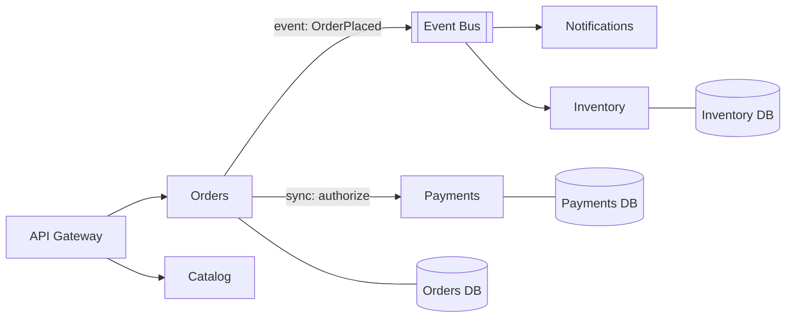

A monolith is one deployable unit; microservices split the system into independently deployed services, each owning its data. The honest framing interviewers respect: **microservices trade code complexity for operational complexity** — you adopt them when organizational scale (many teams shipping independently) or wildly divergent scaling needs demand it, not because they're "modern."

## What each buys you

| | Monolith | Microservices |
| --- | --- | --- |
| Deploy | One unit — simple, but all-or-nothing | Per service — independent, frequent |
| Scaling | Whole app scales together | Hot services scale alone |
| Failure | Process dies → everything | Partial — if isolation is done right |
| Data | One DB; real transactions & joins | DB per service; sagas & eventual consistency |
| Debugging | Stack trace | Distributed trace across N services |
| Team fit | One team, fast iteration | Many teams, clear ownership |

A **modular monolith** (strict module boundaries, one deployable) captures most code-organization benefits with none of the network costs — the strongest "default" answer for a new product.

## Service boundaries

Cut along **business capabilities** (orders, payments, catalog — DDD bounded contexts), not technical layers (a "database service" is an anti-pattern). Two hard rules:

1. **Database per service.** Shared databases recouple everything you just decoupled; other services get data via APIs or events.
2. If two services must change together every sprint, they're one service.

## Communication

- **Sync (REST/gRPC)** — when the caller needs the answer now. Chains of sync calls multiply latency and compound failure probability; keep call depth shallow.
- **Async (events via queue/log)** — when the caller doesn't need a response. Decouples availability; this is the default for cross-service side effects (see [message queues]).
- **Cross-service data consistency** — no distributed transactions in practice; use **sagas**: a sequence of local transactions with compensating actions on failure (cancel reservation if payment fails).

## The tax you must mention

Service discovery, retries with backoff + circuit breakers (one slow dependency can cascade into a full outage), distributed tracing, API versioning, N pipelines to operate. If a design has three engineers and five services, that's a red flag, and saying so in an interview is a point in your favor.

## Interview framing

"Start modular-monolith; extract services where team ownership or scaling actually demands it; each extracted service owns its data and publishes events." Then show you know the failure math — every network hop is a new way to be down, and circuit breakers are how you stop the dominoes.
