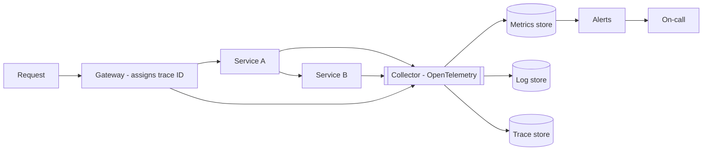

"How do you know it's working?" is the question that separates candidates who've operated systems from those who've only drawn them. Every design should end with a sentence about observability; this article is that sentence, expanded.

## The three pillars

| Pillar | Answers | Shape | Cost profile |
| --- | --- | --- | --- |
| **Metrics** | "Is something wrong?" | Numeric time series (counters, gauges, histograms) | Cheap, aggregated, keep for years |
| **Logs** | "What exactly happened?" | Structured events with context | Expensive at volume, sampled/retained in tiers |
| **Traces** | "Where in the chain?" | Per-request tree of spans across services | Sampled (~1–10%), gold for latency debugging |

They compose into one workflow: a **metric** alert fires → the **trace** shows which hop burned the latency → the **logs** of that service explain why. Design each pillar so this handoff works — which mostly means propagating one thing:

**Correlation/trace ID.** Generated at the edge, passed through every service call (W3C `traceparent` header), stamped on every log line. Without it, debugging a distributed system is grep-and-pray. With it, "show me everything about request X" is one query.

## Metrics that matter

For every service, the **RED** trio: Rate (requests/sec), Errors (failure rate), Duration (latency **as percentiles** — p50/p95/p99, never averages; the p99 is what your unluckiest 1% of users feel, and averages hide it). For infrastructure, **USE**: Utilization, Saturation, Errors.

Histograms beat pre-computed averages because you can't aggregate percentiles after the fact — record distributions.

## SLIs, SLOs, and error budgets

- **SLI** — the measurement: "fraction of requests served successfully under 300 ms."
- **SLO** — the target: "99.9% over 30 days."
- **SLA** — the contract with money attached (external; always looser than the SLO).

The operational payoff is the **error budget**: 99.9% allows ~43 minutes of failure/month. Budget remaining → ship features freely. Budget burned → freeze launches, work on reliability. This turns "how reliable should we be" from a feelings argument into arithmetic — and 100% is explicitly a non-goal, because each extra nine costs ~10× and users can't tell past a point.

## Alerting that doesn't cry wolf

- **Page on symptoms, not causes**: alert on "checkout error rate > 1%", not "CPU > 80%". CPU at 90% serving happy users is Tuesday; paging on it trains on-call to ignore pages.
- Alert on **burn rate** — "we're consuming 30 days of error budget in 6 hours" — which catches both fast outages and slow bleeds without hair-trigger thresholds.
- Every page must be *actionable* and *urgent*; everything else is a ticket or a dashboard. An on-call woken twice for non-issues stops waking up.

## Costs and cardinality

Observability bills grow faster than traffic if unmanaged. The two levers: **sampling** (trace 1% of successes, 100% of errors; tail-based sampling keeps the interesting 1%) and **cardinality control** — a metric labeled by `user_id` creates a time series per user and melts the store. High-cardinality detail belongs in logs/traces, not metric labels.

## Interview Q&A

**Q: p99 latency doubled but p50 is flat. Where do you look?**
A: A tail problem: GC pauses, one slow shard/replica, lock contention, retries amplifying, or a cold cache subset. Traces filtered to slow requests show which hop; compare across instances to find a sick node.

**Q: What do you instrument on day one of a new service?**
A: RED metrics via middleware, structured logs with trace IDs, OpenTelemetry tracing at ingress/egress, a `/healthz`, and one SLO with a burn-rate alert. All boilerplate — bake it into the service template.

**Q: Why are averages banned from latency discussions?**
A: They're distorted by outliers in both directions and describe no actual user. Percentiles map to real experiences: p99 = 1 in 100 requests — for a user making 100 requests per session, that's every session.

**Q: Logs vs traces — aren't traces just fancy logs?**
A: Traces are causally-linked and timed across service boundaries — they answer "where did 800 ms go" structurally. Logs are unlinked detail within one hop. The trace finds the guilty service; its logs convict it.
